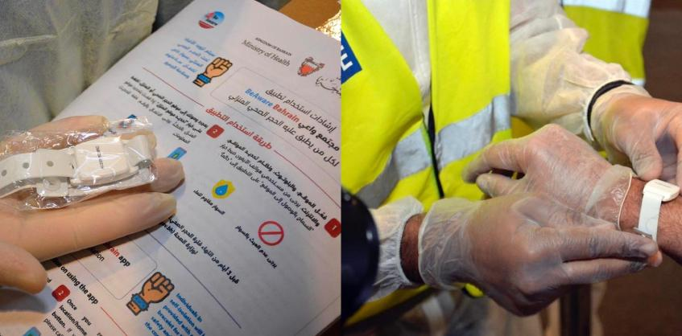

# BeAware Bahrain

BeAware Bahrain is an app written with [Ionic Framework](https://ionicframework.com/) in JavaScript, and using [Apache Cordova](https://cordova.apache.org) for building. It is available both on [Android](https://play.google.com/store/apps/details?id=bh.bahrain.corona.tracker) and [iOS](https://apps.apple.com/app/id1501478858). At the time of writing the Android app counts 100'000+ downloads.

The app has numerous features, from location tracking, to booking testing appointments, and retrieving results. For example, the app can occasionally request the user to upload a photo to prove they are self-isolating. It also supports requesting permissions to leave self-isolation. This is the [self-described functionality](https://apps.bahrain.bh/CMSWebApplication/action/ShowAppDetailsAction?selectedAppID=321&appLanguage=en):

> The app utilises location data shared by users to do the following:
>
>    - Notify Individuals in the event they are approaching a location where an active case has been detected, or if they were in close proximity with an active confirmed cases
>    - Track the movement of home quarantine cases for a duration of 14 days, and ensure user cases abide by quarantine regulations
>    - Allows self-isolation individuals to book their exit test appointment.
>    - Highlight official local & international statistics on COVID-19 developments
>    - Publish latest recommendations issued by the Kingdom’s health authorities & general information about the virus

This analysis concentrates on the potential privacy violations from the harvesting and automatic upload of personal data.


## Table of contents

<!--ts-->
   * [Summary of findings](#summary-of-findings)
   * [Registration](#registration)
   * [Location tracking](#location-tracking)
   * [Bracelet tracking](#bracelet-tracking)
   * [Cases details](#cases-details)
<!--te-->


## Summary of findings

1. The app requires registration. It allows to register as a resident, or as a visitor, requesting respectively a **national ID number** or a **passport number**, along with a valid **phone number**. The app will perform an OTP verification via SMS.
2. As soon as the app is installed, it starts to collect location data. **The GPS coordinates of the phone are automatically uploaded to the backend**. Location information is coupled with a device ID, the user's phone number and passport or ID number.
3. It allows the user to set a quarantine location, which will be used as a geofence. The app will monitor if the user is entering or exiting quarantine.
4. It supports pairing with a [bluetooth bracelet](http://www.iga.gov.bh/en/article/the-iga-begins-distribution-of-electronic-bracelets-compatible-with-beaware-app). The bracelet is used to make sure the user remains in proximity of the phone.
5. In a recent version, the app introduced an opt-out setting for the "[Are you at home?](http://www.iga.gov.bh/en/article/iGA-Adds-Opt-Out-Feature-to-BeAware-App-Making-Participation-in-Are-You-at-Home-TV-Show-Optional
)" national TV program, where random users from the app are drawn and called up.


## Registration

First, the app requests the user to enter a valid phone number and either a national ID or a passport number. This information is then sent to the backend in order to request an OTP verification SMS.

```
POST https://apps.bahrain.bh/corona-tracking-client-api/registration/send-otp

{
    "smsLanguage": "english",
    "userDevice": {
        "deviceId": "[REDACTED]",
        "mobileNumber": "+44[REDACTED]",
        "userId": "[REDACTED]",
        "userType": "passport"
    }
}

HTTP/2.0 200

{
    "displayMessage": {
        "arabic": "تم إرسال رمز التحقق.",
        "english": "Confirmation code has been sent",
        "id": "sendOtpSuccess",
        "type": "toast"
    }
}
```

the `deviceId` is retrieved from [cordova-plugin-device](https://github.com/apache/cordova-plugin-device). It is static and will be tied to every future data upload.

Once the user enters the OTP received via SMS, it sends it to the backend completes the registration:

```
POST https://apps.bahrain.bh/corona-tracking-client-api/registration/register

{
    "otp": "123456",
    "userDevice": {
        "deviceId": "[REDACTED]",
        "mobileNumber": "+44[REDACTED]",
        "userId": "[REDACTED]",
        "userType": "passport"
    }
}

HTTP/2.0 200

{
    "displayMessage": {
        "arabic": "شكرًا لتسجيلك.",
        "english": "Thank you for registering.",
        "id": "registerSuccess",
        "type": "toast"
    }
}
```

Therefore, the operators of the app are able to tie any data upload to an identifiable individual.


## Location tracking

The app uses transistorsoft's [Cordova Background Geolocation](https://github.com/transistorsoft/cordova-background-geolocation-lt) plugin for tracking GPS coordinates of the user. This is how the tracking is instantiated upon successful registration:

```javascript
BackgroundGeolocation.ready({
  debug: false,
  reset: true,
  logLevel: BackgroundGeolocation.LOG_LEVEL_VERBOSE,
  geofenceModeHighAccuracy: isGeoFence ? true : false,
  desiredAccuracy: BackgroundGeolocation.DESIRED_ACCURACY_HIGH,
  distanceFilter: 10,
  locationUpdateInterval: 60000,
  stopTimeout: 5,
  showsBackgroundLocationIndicator: false,
  stopOnTerminate: false,
  startOnBoot: true,
  url: this.baseURL + 'locations',
  autoSync: true,
  locationAuthorizationRequest: "Always",
  disableLocationAuthorizationAlert: false,
  logMaxDays: 3,
  stopOnStationary: false,
  stationaryRadius: 5,
  allowIdenticalLocations: true,
  preventSuspend: isGeoFence ? true : false,
  heartbeatInterval: 60,
  geofenceInitialTriggerEntry: isGeoFence ? true : false,
  geofenceProximityRadius: 20,
  locationAuthorizationAlert: {
    titleWhenNotEnabled: this.translate.instant('COMMON.LOCATIONTITLE'),
    titleWhenOff: this.translate.instant('COMMON.LOCATIONTITLE'),
    instructions: this.translate.instant('COMMON.LOCATIONMESSAGE'),
    cancelButton: this.translate.instant('COMMON.CANCEL'),
    settingsButton: this.translate.instant('SETTINGS.TITLE'),
  },
  activityType: BackgroundGeolocation.ACTIVITY_TYPE_OTHER,
  params: {
    "userDevice": this.profile
  }
}
```

If the device appears to be moving and is not stationary, the app aggressively tracks movements. The GPS coordinates are then stored locally and uploaded to `https://apps.bahrain.bh/corona-tracking-client-api/locations` along with the user's registration details. This is an example of a location update event uploaded during our tests (some information is redacted):

```json
{
    "location": {
        "activity": {
            "confidence": 100,
            "type": "still"
        },
        "battery": {
            "is_charging": true,
            "level": 1
        },
        "coords": {
            "accuracy": 11.9,
            "altitude": 88.7,
            "heading": -1,
            "latitude": -12.3456789,
            "longitude": -12.3456789,
            "speed": -1
        },
        "event": "motionchange",
        "extras": {},
        "is_moving": false,
        "odometer": 0,
        "timestamp": "2020-05-10T00:00:00.00)Z",
        "uuid": "[REDACTED]"
    },
    "userDevice": {
        "deviceId": "[REDACTED]",
        "mobileNumber": "+44[REDACTED]",
        "userId": "[REDACTED]",
        "userType": "passport"
    }
}
```

This consitutes a severe privacy violation. Operators of the app are live monitoring movements of the tens of thousands of people with the app installed.

Worth noting, `BackgroundGeolocation` supports [geofencing](https://transistorsoft.github.io/cordova-background-geolocation-lt/interfaces/_cordova_background_geolocation_lt_.geofence.html), which is used by the app for monitoring any exits of a defined quarantine area.

```javascript
async startGeoFence(location: models.LatLon) {
  console.log("startGeoFence location.coords.latitude" + location.lat);
  console.log("startGeoFence location.coords.longitude" + location.lat);
  let configListObj = await this.storage.get('configListObj')
  let radius = configListObj['GEOFENCE_RADIUS'];
  console.log("startGeoFence radius" + radius);
  BackgroundGeolocation.addGeofence({
    identifier: "HOME",
    radius: radius ? radius : 200,
    latitude: location.lat,
    longitude: location.lon,
    notifyOnEntry: true,
    notifyOnExit: true,
  }).then((success) => {
    console.log("[addGeofence] success", success);
  }).catch((error) => {
    console.log("[addGeofence] FAILURE: ", error);
  });
  if (this.platform.is('ios')) {
    this.configureBackgroundGeolocation(true);
  }
  this.serviceProvider.gaTrackEvent("HomePage", "StartQuarantine");
}
```


## Bracelet tracking

Already in early April, authorities in Bahrain [started distributing Bluetooth bracelets](http://www.iga.gov.bh/en/article/the-iga-begins-distribution-of-electronic-bracelets-compatible-with-beaware-app) to people in quarantine:

> Al Qaed said: “The decision issued by HE the Minister of Health, Faeqa bint Saed Al Saleh, obliges self-isolating individuals to wear the electronic bracelet that will notify the monitoring station when they are 15 meters away from their phone, in which case a warning will be sent. Violators will face legal penalties as per Public Health Law No. 34 for the year 2018, potentially being sentenced to imprisonment for a period not less than 3 months and a fine between BD1,000 and BD10,000, or either one of the two penalties.”



*Picture from www.iga.gov.bh*

The app uses Ionic's [IBeacon](https://ionicframework.com/docs/native/ibeacon/) plugin in order to monitor if a Bluetooth bracelet provided to the user remains within range or not.

```javascript
listenToBeaconEvents() {
  let beaconId = localStorage.getItem('beaconId');
  beaconId = this.platform.is('ios') ? beaconId : _.toLower(beaconId);
  console.log('listenToBeaconEvents beaconId', beaconId);
  this.events.subscribe('didRangeBeaconsInRegion', (data) => {
    this.zone.run(() => {
      this.beacons = [];
      let beaconList = data.beacons;
      let statedata = _.find(beaconList, ['uuid', beaconId]);
      this.currentBeaconState = statedata ? true : false;
      beaconList.forEach((beacon) => {
        let beaconObject = new BeaconModel(beacon);
        this.beacons.push(beaconObject);
      });
    });
  });

  this.events.subscribe('blueToothStateChanged', (data) => {
    this.zone.run(async () => {
      let blueToothState = await this.beaconProvider.getBluetoothState();
      this.currentBeaconState = blueToothState == true ? this.currentBeaconState : false;
    });
  });
}
```

Information on the state of the bluetooth bracelet, along with additional diagnostic, is regularly sent to the server:

```javascript
let checkProfile: models.RegistrationCheckRequest = {
  userDevice: _.cloneDeep(this.profile),                                          // Information on the user & device.
  isBeaconInRange: beaconIdStorage == null ? undefined : this.currentBeaconState, // Current status of the bracelet.
  bluetoothState: bluetoothState,                                                 // If Bluetooth is enabled.
  bluetoothAvailable: bluetoothAvailable,                                         // If device has Bluetooth capabilities.
  locationState: locationState,                                                   // If Location Services are enabled.
  locationAvailable: locationAvailable,                                           // If device has GPS.
  notificationsState: notificationsState,                                         // If app has notification authorized.
  notificationsAvailable: notificationsAvailable,                                 // If push notifications are available.
  appLanguage: this.translate.getDefaultLang() == 'en' ? 'english' : 'arabic',
  currentTime: new Date()
};
```


# Cases details

The app embeds page called "Cases details" which is not actually displayed in the app's interface. A menu access to this page is, in latest versions, commented out.

Although this page is currently disabled from public view, the code would fetch data from the URL `https://apps.bahrain.bh/eGACommonService/services/secure/cs/getContentByServiceId/1.0?serviceName=BCT_CONTACT_TRACING`. When accessed with the appropriate connection details, the server returns data in JSON format containing what appears to be a list of 755 COVID-19 cases.

```json
{
  "caseNumber": "105",
  "dischargedStatus": {
    "id": "dischargedStatus650",
    "arabic": "?????",
    "english": "Discharged"
  },
  "age": "[REDACTED]",
  "nationality": {
    "id": "nationality650",
    "arabic": "???????",
    "english": "[REDACTED]"
  },
  "gender": "[REDACTED]",
  "travelHistory": {
    "id": "travelHistory650",
    "arabic": "????? ??  ????? ?????? [REDACTED] - ?? ????? ?? ????? ????? ?????????",
    "english": "Arrived from [REDACTED] on [REDACTED]-Tested positive in quarantine"
  },
  "contactTracing": {
    "id": "contactTracing650",
    "arabic": "?? ?????",
    "english": "NA"
  }
},
```

```json
{
  "caseNumber": "755",
  "dischargedStatus": {
    "id": "dischargedStatus0",
    "arabic": "",
    "english": ""
  },
  "age": "[REDACTED]",
  "nationality": {
    "id": "nationality0",
    "arabic": "????",
    "english": "[REDACTED]"
  },
  "gender": "[REDACTED]",
  "travelHistory": {
    "id": "travelHistory0",
    "arabic": "?? ?????",
    "english": "Not applicable"
  },
  "contactTracing": {
    "id": "contactTracing0",
    "arabic": "???? ?? ?????? ???????? ?? ???? ??? ????? ????? ????????? ?? ???????",
    "english": "One of the foreign workers who tested positive whilst under quarantine in Salmabad"
  }
},
```

An additional field in the JSON data suggests this list was last updated on April 22nd 2020. While this data does not contain any names, it contains enough sensitive details that might lead to the identification of individuals diagnosed with COVID-19. We notified the Bahraini authorities of this problem on June 1st. Despite receiving no answers, the server responds with an empty list since June 2nd:

```json
{"list":[],"publishDate":"20200602140155","publishDateISO":"2020-06-02T11:01:55Z"}
```

**Update**: We later noticed, this same data is actively maintained by Bahraini authorities on the [website of the Ministry of Health](https://www.moh.gov.bh/COVID19/ContactsTracing), offering a publicly accessible and searchable list of all COVID-19 cases.
