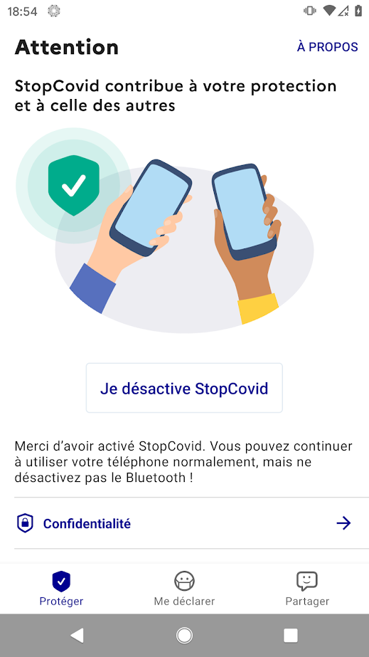

# StopCovid

France has developed a contact-tracing app called "StopCovid". It was published on the 2nd of June. Contrary to most European countries, the app is based on Bluetooth contract tracing using a centralised database. The app is implementing the [ROBERT protocol](https://github.com/ROBERT-proximity-tracing/documents) developed by French research institute INRIA. StopCovid is available for [Android](https://play.google.com/store/apps/details?id=fr.gouv.android.stopcovid) and [iOS](https://apps.apple.com/app/id1511279125) and its code for the clients and server is [open-source](https://gitlab.inria.fr/stopcovid19).




## Table of contents

<!--ts-->
   * [Summary of findings](#summary-of-findings)
   * [Registration](#registration)
   * [Bluetooth messages](#bluetooth-messages)
   * [Reporting data](#reporting-data)
   * [Data storage](#data-storage)
   * [Metadata](#metadata)
<!--te-->


## Summary of findings

1. The app **does not requires any personal information** at registration.
2. The app uses Bluetooth Low Energy to transmit temporary identifiers to phones with StopCovid app nearby. When someone is infected, they send tokens of phones they have been in contact with for the last 14 days maximum.
3. The central database keep track of risk status of anonymised profiles. Users can check their risk status from the central server.
4. **The centralisation of the data creates a risk of deanonymizing the user's profiles.** The protocol definition suggests several ways to mitigate that issue, but none of them were implemented in the app. The lack of transparency on the implementation of the server raises some concerns over the possibility of deanonymizing users based on metadata.


## Registration

The registration is done with a request to `https://api.stopcovid.gouv.fr/register` with the captch resolution and a public key of an ECDH key. In [ServiceDataSource.kt](https://gitlab.inria.fr/stopcovid19/stopcovid-android/-/blob/master/framework/src/main/java/com/lunabeestudio/framework/remote/datasource/ServiceDataSource.kt):
i
```java
    override suspend fun register(captcha: String, clientPublicECDHKey: String): RobertResultData<RegisterReport> {
        val result = tryCatchRequestData {
            api.register(ApiRegisterRQ(captcha = captcha, clientPublicECDHKey = clientPublicECDHKey))
        }
        return when (result) {
            is RobertResultData.Success -> RobertResultData.Success(result.data.toDomain())
            is RobertResultData.Failure -> RobertResultData.Failure(result.error)
        }
    }
```

The ECDH key pair is created on the device as an identifier, see in [RemoteServiceRepository.kt](https://gitlab.inria.fr/stopcovid19/stopcovid-android/-/blob/master/robert/src/main/java/com/lunabeestudio/robert/repository/RemoteServiceRepository.kt):

```java
 suspend fun register(captcha: String): RobertResultData<RegisterReport> {
        val keyPair = sharedCryptoDataSource.createECDHKeyPair()

        val publicKey64 = Base64.encodeToString(keyPair.public.encoded, Base64.NO_WRAP)
        val registerResult = remoteServiceDataSource.register(captcha, publicKey64)
```


## Bluetooth messages

Bluetooth Low-Energy Gatt services are used to provide information that can be read by other StopCovid apps. The Gatt service is implemented in [BleGattManagerImpl.kt](https://gitlab.inria.fr/stopcovid19/stopcovid-android/-/blob/master/ble/src/main/java/com/orange/proximitynotification/ble/gatt/BleGattManagerImpl.kt):

```kotlin
super.onCharacteristicWriteRequest(
            device,
            requestId,
            characteristic,
            preparedWrite,
            responseNeeded,
            offset,
            value
        )

        Timber.d("onCharacteristicWriteRequest")

        val result = when (characteristic.uuid) {
            payloadCharacteristic.uuid -> {
                if (offset != 0) {
                    BluetoothGatt.GATT_INVALID_OFFSET
                } else {
                    value?.let { callback.onWritePayloadRequest(device, it) }
                    BluetoothGatt.GATT_SUCCESS
                }
            }
            else -> BluetoothGatt.GATT_FAILURE

        }
```


## Reporting data

When a StopCovid user is identified as having COVID-19, they can decide to report the their infection along with the list of all identifiers recorded from smartphones nearby. The report code is implemented in [RobertManagerImpl.kt](https://gitlab.inria.fr/stopcovid19/stopcovid-android/-/blob/master/robert/src/main/java/com/lunabeestudio/robert/RobertManagerImpl.kt):

```kotlin
override suspend fun report(token: String, firstSymptoms: Int, application: RobertApplication): RobertResult {
    val firstProximityToSendTime = (System.currentTimeMillis() - TimeUnit.DAYS.toMillis(firstSymptoms.toLong()) - TimeUnit.DAYS.toMillis(
        (keystoreRepository.preSymptomsSpan ?: RobertConstant.PRE_SYMPTOMS_SPAN).toLong())).unixTimeMsToNtpTimeS()
    val result = remoteServiceRepository.report(token, localProximityRepository.getUntilTime(firstProximityToSendTime))
    return when (result) {
        is RobertResult.Success -> {
            val ssu = getSSU(RobertConstant.PREFIX.C3)
            if (ssu is RobertResultData.Success) {
                remoteServiceRepository.unregister(ssu.data)
            }
            clearLocalData(application)
            keystoreRepository.isSick = true
            result
        }
        else -> result
    }
}
```

## Data storage

The database on the central server keeps information on all people who registered to the application, and detect if they are at risk based on messages shared by people infected by COVID-19. The code is available in the [robert-server](https://gitlab.inria.fr/stopcovid19/robert-server/-/blob/develop/robert-server-database/src/main/java/fr/gouv/stopc/robertserver/database/model/Registration.java) repository, here is the database model for an user:

```java
public class Registration {
	@Id
	@ToString.Exclude
	private byte[] permanentIdentifier;
	private boolean isNotified;
	private boolean atRisk;
	private int lastStatusRequestEpoch;
	private int latestRiskEpoch;
	@Builder.Default
	private List<EpochExposition> exposedEpochs = new ArrayList<>();
}
```

This database model does not include any personal information, or any information that could allow to link a profile to the actual person, but keeping this data centralised creates more risks of de-anonymization of data.


## Metadata

Maintaining anonymous profiles on the central server creates a risk of de-anonymisation of the data, especially when an infected user is sending the list of tokens of people they interacted with to the central server. This question is adressed in the [Protocol Specifications](https://github.com/ROBERT-proximity-tracing/documents/blob/master/ROBERT-specification-EN-v1_1.pdf) at the section 6.1 :

```
Upload Mechanism: A LocalProximityList contains the EBIDs of the devices that the infected user has encountered in the last CT days. This information together with the timing information associated with each HELLO message could be used to build the de-identified social/proximity graph of the infected user. The aggregation of many such social/proximity graphs may lead, under some conditions, to the de-anonymization of its nodes, which results in the social graphs of the users.

Would that be a concern, it is necessary to ”break” the link between any two EBIDs contained in the LocalProximityList to prevent the server from getting get this information. Therefore, instead of uploading the LocalProximityList our scheme uploads each of its elements independently. Different solutions can be envisioned to achieve this goal:
* The (HELLO, T ime) pairs of the LocalProximityList are sent to the server one by one using a Mixnet. Upon reception of these messages, the server won’t be able to associate them with a LocalProximityList if the upload is spread over a long period of time.
• The LocalProximityList is uploaded on a trusted server (for example at a hospital or health organization) that mixes all the (HELLO, T ime) pairs of all infected users’ LocalProximityList. The back-end server has only access to the exposed entries via a specific API provided by the trusted server.
• The back-end server is equipped with some secure hardware component that processes the uploads of the LocalProximityList. The back-end server has only access to the exposed entries via a specific API provided by the secure hardware module.
```

However, the app does not implement any of these mitigations. All the tokens obtained from near-by smartphones are sent at once to the central server. This creates a risk of identifying the social graph of an user on the server. Furthermore, the communication metadata (IP address, port) could also be used to deanonymise profiles on the server by linking an IP address to an identity. This problem was raised several times during the design of the protocol [but ignored](https://github.com/ROBERT-proximity-tracing/documents/issues/30).

Because of this centralisation, the anonymity of the profiles on the central server relies on the implemention of the server and the data recorded on it. The source code of the server is [partially open-source](https://gitlab.inria.fr/stopcovid19/robert-server) but several independent researchers identified [some additional components on the server](https://twitter.com/juliendubois/status/1270981349588025345) that were not disclosed in the open-source repository, and [may record IP addresses of users](https://www.numerama.com/tech/629727-stopcovid-et-maintenant-une-polemique-sur-les-adresses-ip-des-utilisateurs.html).

This lack of transparency and risk of deanonymisation of users raises some valid privacy concerns.
