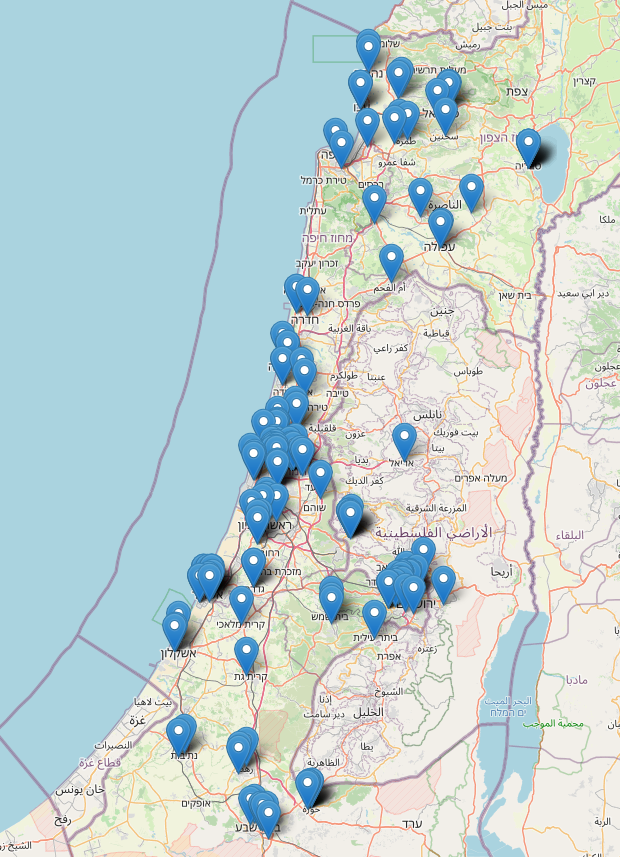

# Hamagen

Israel's Ministry of Health launched an app called "[Hamagen](https://github.com/MohGovIL/hamagen-react-native)" for COVID-19 contact tracing in the country. It is available on both [Android](https://play.google.com/store/apps/details?id=com.hamagen) and [iOS](https://apps.apple.com/us/app/%D7%94%D7%9E%D7%92%D7%9F-%D7%90%D7%A4%D7%9C%D7%99%D7%A7%D7%A6%D7%99%D7%94-%D7%9C%D7%9E%D7%9C%D7%97%D7%9E%D7%94-%D7%91%D7%A7%D7%95%D7%A8%D7%95%D7%A0%D7%94/id1503224314). The app is [open source](https://github.com/MohGovIL/hamagen-react-native) and written in React Native. At the time of writing, the Android app counts more than 1'000'000 downloads.

Following is a schema of the app's functioning as [provided by the developers](https://medium.com/proferosec-osm/hamagen-application-fighiting-the-corona-virus-4ecf55eb4f7c):


## Table of contents

<!--ts-->
   * [Summary of findings](#summary-of-findings)
   * [Location tracking](#location-tracking)
   * [Wi-Fi tracking](#wi-fi-tracking)
   * [Configuration](#configuration)
<!--te-->


## Summary of findings

1. The app appears to be voluntary.
2. The app locally records GPS location history. This data does not appear to be uploaded automatically.
3. The app regularly downloads a list of GPS points from `https://gisweb.azureedge.net/PointsUtc.json`, marking locations diagnosed patients have previously visited. This download seems to be restricted to IP addresses from Israel. Hamagen then compares the local location history with the downloaded points to determine if the user was in the same place during the same timeframe as diagnosed patients. A warning seems to be determined if the user was in a 50 meters radius.
4. Hamagen also scans for Wi-Fi networks in the proximity and locally records their BSSIDs. This data does not appear to be uploaded anywhere automatically.


## Location tracking

The app uses transistorsoft's [Background Geolocation for React Native](https://github.com/transistorsoft/react-native-background-geolocation) plugin in order to locally record location history:

```javascript
await BackgroundGeolocation.ready({
  // Geolocation Config
  desiredAccuracy: BackgroundGeolocation.DESIRED_ACCURACY_HIGH,
  distanceFilter: config().sampleDistance,
  locationUpdateInterval: config().sampleInterval,
  fastestLocationUpdateInterval: config().sampleInterval,
  // Activity Recognition
  disableMotionActivityUpdates,
  stopTimeout: 1,
  // Application config
  logLevel: BackgroundGeolocation.LOG_LEVEL_VERBOSE,
  stopOnTerminate: false,
  startOnBoot: true,
  foregroundService: true,
  notification: {
    text: notificationData.androidNotification[locale]
  },
  enableHeadless: true,
  persistMode: BackgroundGeolocation.PERSIST_MODE_LOCATION,
  maxRecordsToPersist: -1,
  maxDaysToPersist: 10000000
}, (state) => {
  console.log('BackgroundGeolocation is configured and ready: ', state.enabled);

  if (!state.enabled) {
    // //
    // 3. Start tracking!
    //
    BackgroundGeolocation.start(() => {
      console.log('react-native-background-geolocation - Start success');
    });
  }
});
```

This location data is not uploaded to any central location, but instead compared to a list of GPS points other diagnosed patients have visited in order to determine any exposure risk:

```javascript
export const getIntersectingSickRecords = (myData: Location[], sickRecordsJson: SickJSON) => {
  const sickPeopleIntersected: any = [];

  if (myData.length === 0) {
    console.log('Could not find data');
  } else {
    // for each feature in json data
    sickRecordsJson.features.map((sickRecord: Exposure) => {
      // for each raw in user data
      myData.reverse().forEach((userRecord: Location) => {
        if (
          isTimeOverlapping(userRecord, sickRecord)
          && isSpaceOverlapping(userRecord, sickRecord)
        ) {
          // add sick people you intersects
          sickRecord.properties.fromTime_utc = Math.max(userRecord.startTime, sickRecord.properties.fromTime_utc);
          sickRecord.properties.toTime_utc = userRecord.endTime;
          sickPeopleIntersected.push(sickRecord);
        }
      });
    });
  }

  return sickPeopleIntersected;
};
````

Paired with `isTimeOverlapping`, the function `isSpaceOverlapping` determines if the user has been in a provided radius distance from the provided points:

```javascript
export const isSpaceOverlapping = ({ lat, long }: Location, { properties: { radius }, geometry: { coordinates } }: Exposure) => {
  const start = {
    latitude: lat,
    longitude: long,
  };

  const end = {
    latitude: coordinates[config().sickGeometryLatIndex],
    longitude: coordinates[config().sickGeometryLongIndex],
  };

  return haversine(start, end, { threshold: radius || config().meterRadius, unit: config().bufferUnits });
};
````

According to the downloaded [configuration](#configuration), the `meterRadius` value is of 50 meters.

The app regularly downloads a list of points from `https://gisweb.azureedge.net/PointsUtc.json` and compare them to the device's location history. The download seems to be blocked for IP addresses outside of Israel. Following is a plotting of the points downloaded at the time of writing:



**It's important to note** that from a quick analysis, it appears these points only refer to public spaces, medical facilities, shops, malls, etc. The data does not seem to contain coordinates to private homes.


## Wi-Fi tracking

Hamagen app also tracks and locally records Wi-Fi networks in the proximity:

```javascript
export const getWifiList = () => new Promise(async (resolve, reject) => {
  try {
    let bssids;
    let bssidsToConvert = '';
    let hexBssidsString;
    if (IS_IOS) {
      bssids = await NetworkInfo.getBSSID();

      if (bssids) {
        hexBssidsString = await sha1(bssids);
        resolve({ wifiHash: hexBssidsString, wifiList: bssids });
      }

      resolve({ wifiHash: '', wifiList: '' });
    } else {
      WifiManager.loadWifiList(async (wifiObjects) => {
        bssids = orderListOfMacAddresses(JSON.parse(wifiObjects));
        for (let i = 0; i < bssids.length; i++) {
          bssidsToConvert = bssidsToConvert.concat(i !== 0 ? ',' : '', bssids[i].BSSID.replace(/:/g, ''));
        }
        hexBssidsString = await sha1(bssidsToConvert);
        resolve({ wifiHash: hexBssidsString, wifiList: bssidsToConvert });
      }, (e) => {
        console.log('Cannot get current SSID!', e);
        reject(e);
      });
    }
  } catch (e) {
    console.log('Cannot get current SSID!', e);
    reject(e);
  }
});
```

For each discovered Wi-Fi network, the SSID is recorded. This data does not seem to be uploaded anywhere, but it might used at a later stage, in case users are diagnosed with COVID-19, in order to provide additional information on location history.


## Configuration

At the time of writing, the app downloads the following configuration file to set certain execution parameters:

```json
{
  "com.hamagen.dev": {
    "dataUrl": "https://matrixdemos.blob.core.windows.net/mabar/Points.json",
    "dataUrl_utc": "https://matrixdemos.blob.core.windows.net/mabar/Points.json",
    "stringsUrl": "https://matrixdemos.blob.core.windows.net/mabar/texts.json",
    "versionsUrl": "https://matrixdemos.blob.core.windows.net/mabar/versions.json",
    "sampleDistance": 50,
    "sampleInterval": 60000,
    "fetchMilliseconds": 900000,
    "meterRadius": 50,
    "intersectMilliseconds": 1,
    "bufferUnits": "meter",
    "sickGeometryLongIndex": 0,
    "sickGeometryLatIndex": 1,
    "locationServiceIgnoreList": [
      "running",
      "on_bicycle",
      "in_vehicle"
    ],
    "locationServiceIgnoreConfidenceThreshold": 80,
    "locationServiceIgnoreSampleVelocityThreshold": 2.8,
    "locationHistoryIgnoreList": [
      "On a train",
      "In a taxi or rideshare",
      "Driving",
      "Running",
      "Cycling",
      "Flying",
      "On a bus",
      "Boating",
      "Motorcycling",
      "Swimming"
    ],
    "androidNotification": {
      "he": "אפליקציית המגן רצה ברקע ומגנה עליך",
      "en": "Hamagen runs in the background and protects you",
      "am": "የተከላካይ መተግበሪያ በጀርባ ውስጥ ይሠራል እና እርስዎን ይጠብቃል",
      "ru": "Хамаген бежит в фоновом режиме и защищает тебя",
      "ar": "يعمل تطبيق המגן في الخلفية ويحميك",
      "fr": "Hamagen court en arrière-plan et vous protège"
    },
    "sickMessage": {
      "he": {
        "title": "יתכן כי זוהתה חשיפה אחת או יותר",
        "body": "יש ללחוץ כאן כדי לברר אם נחשפת"
      },
      "en": {
        "title": "One or more exposures may have been detected",
        "body": "Click here to find out if you have been exposed"
      },
      "am": {
        "title": "አንድ ወይም ከዚያ በላይ ተጋላጭነቶች ተከስተው ሊሆን ይችላል",
        "body": "የተጋለጡ መሆንዎን ለማወቅ እዚህ ጠቅ ያድርጉ"
      },
      "ru": {
        "title": "Возможно, обнаружено одно или несколько совпадений",
        "body": "Нажмите здесь, чтобы узнать, если вы были выставлены"
      },
      "ar": {
        "title": "ربما تم الكشف عن تداخل واحد أو أكثر",
        "body": "انقر هنا لمعرفة ما إذا كنت قد تعرضت"
      },
      "fr": {
        "title": "Une ou plusieurs expositions peuvent avoir été détectées",
        "body": "Cliquez ici pour savoir si vous avez été exposé "
      },
      "duration": 10000
    },
    "furtherInstructions": {
      "he": "https://govextra.gov.il/ministry-of-health/corona/corona-virus/",
      "en": "https://govextra.gov.il/ministry-of-health/corona/corona-virus-en/",
      "am": "https://govextra.gov.il/ministry-of-health/corona/corona-virus/",
      "ru": "https://govextra.gov.il/ministry-of-health/corona/corona-virus-ru",
      "ar": "https://govextra.gov.il/ministry-of-health/corona/corona-virus-ar/",
      "fr": "https://govextra.gov.il/ministry-of-health/corona/corona-virus/"
    },
    "reportForm": {
      "he": "https://govforms.gov.il/mw/forms/QuarantineForExposees%40health.gov.il",
      "en": "https://govforms.gov.il/mw/forms/QuarantineForExposees%40health.gov.il",
      "am": "https://govforms.gov.il/mw/forms/QuarantineForExposees%40health.gov.il",
      "ru": "https://govforms.gov.il/mw/forms/QuarantineForExposees%40health.gov.il",
      "ar": "https://govforms.gov.il/mw/forms/QuarantineForExposees%40health.gov.il",
      "fr": "https://govforms.gov.il/mw/forms/QuarantineForExposees%40health.gov.il"
    },
    "usageTerms": {
      "he": "https://go.gov.il/magen-terms-he",
      "en": "https://go.gov.il/magen-terms-en",
      "ar": "https://go.gov.il/magen-terms-ar",
      "ru": "https://go.gov.il/magen-terms-ru",
      "am": "https://go.gov.il/magen-terms-am",
      "fr": "https://go.gov.il/magen-terms-fr"
    },
    "privacyTerms": {
      "he": "https://go.gov.il/HAMAGEN",
      "en": "https://go.gov.il/HAMAGEN-EN",
      "ar": "https://go.gov.il/HAMAGEN-AR",
      "ru": "https://go.gov.il/HAMAGEN-RU",
      "am": "https://go.gov.il/HAMAGEN-AM",
      "fr": "https://go.gov.il/HAMAGEN-FR"
    }
  },
  "com.hamagen.qa": {
    "dataUrl": "https://matrixdemos.blob.core.windows.net/mabar/Points.json",
    "dataUrl_utc": "https://matrixdemos.blob.core.windows.net/mabar/Points.json",
    "stringsUrl": "https://matrixdemos.blob.core.windows.net/mabar/texts.json",
    "versionsUrl": "https://matrixdemos.blob.core.windows.net/mabar/versions.json",
    "sampleDistance": 50,
    "sampleInterval": 60000,
    "fetchMilliseconds": 900000,
    "meterRadius": 50,
    "intersectMilliseconds": 1,
    "bufferUnits": "meter",
    "sickGeometryLongIndex": 0,
    "sickGeometryLatIndex": 1,
    "locationServiceIgnoreList": [
      "running",
      "on_bicycle",
      "in_vehicle"
    ],
    "locationServiceIgnoreConfidenceThreshold": 80,
    "locationServiceIgnoreSampleVelocityThreshold": 2.8,
    "locationHistoryIgnoreList": [
      "On a train",
      "In a taxi or rideshare",
      "Driving",
      "Running",
      "Cycling",
      "Flying",
      "On a bus",
      "Boating",
      "Motorcycling",
      "Swimming"
    ],
    "androidNotification": {
      "he": "אפליקציית המגן רצה ברקע ומגנה עליך",
      "en": "Hamagen runs in the background and protects you",
      "am": "የተከላካይ መተግበሪያ በጀርባ ውስጥ ይሠራል እና እርስዎን ይጠብቃል",
      "ru": "Хамаген бежит в фоновом режиме и защищает тебя",
      "ar": "يعمل تطبيق המגן في الخلفية ويحميك",
      "fr": "Hamagen court en arrière-plan et vous protège"
    },
    "sickMessage": {
      "he": {
        "title": "יתכן כי זוהתה חשיפה אחת או יותר",
        "body": "יש ללחוץ כאן כדי לברר אם נחשפת"
      },
      "en": {
        "title": "One or more exposures may have been detected",
        "body": "Click here to find out if you have been exposed"
      },
      "am": {
        "title": "አንድ ወይም ከዚያ በላይ ተጋላጭነቶች ተከስተው ሊሆን ይችላል",
        "body": "የተጋለጡ መሆንዎን ለማወቅ እዚህ ጠቅ ያድርጉ"
      },
      "ru": {
        "title": "Возможно, обнаружено одно или несколько совпадений",
        "body": "Нажмите здесь, чтобы узнать, если вы были выставлены"
      },
      "ar": {
        "title": "ربما تم الكشف عن تداخل واحد أو أكثر",
        "body": "انقر هنا لمعرفة ما إذا كنت قد تعرضت"
      },
      "fr": {
        "title": "Une ou plusieurs expositions peuvent avoir été détectées",
        "body": "Cliquez ici pour savoir si vous avez été exposé "
      },
      "duration": 10000
    },
    "furtherInstructions": {
      "he": "https://govextra.gov.il/ministry-of-health/corona/corona-virus/",
      "en": "https://govextra.gov.il/ministry-of-health/corona/corona-virus-en/",
      "am": "https://govextra.gov.il/ministry-of-health/corona/corona-virus/",
      "ru": "https://govextra.gov.il/ministry-of-health/corona/corona-virus-ru",
      "ar": "https://govextra.gov.il/ministry-of-health/corona/corona-virus-ar/",
      "fr": "https://govextra.gov.il/ministry-of-health/corona/corona-virus/"
    },
    "reportForm": {
      "he": "https://govforms.gov.il/mw/forms/QuarantineForExposees%40health.gov.il",
      "en": "https://govforms.gov.il/mw/forms/QuarantineForExposees%40health.gov.il",
      "am": "https://govforms.gov.il/mw/forms/QuarantineForExposees%40health.gov.il",
      "ru": "https://govforms.gov.il/mw/forms/QuarantineForExposees%40health.gov.il",
      "ar": "https://govforms.gov.il/mw/forms/QuarantineForExposees%40health.gov.il",
      "fr": "https://govforms.gov.il/mw/forms/QuarantineForExposees%40health.gov.il"
    },
    "usageTerms": {
      "he": "https://go.gov.il/magen-terms-he",
      "en": "https://go.gov.il/magen-terms-en",
      "ar": "https://go.gov.il/magen-terms-ar",
      "ru": "https://go.gov.il/magen-terms-ru",
      "am": "https://go.gov.il/magen-terms-am",
      "fr": "https://go.gov.il/magen-terms-fr"
    },
    "privacyTerms": {
      "he": "https://go.gov.il/HAMAGEN",
      "en": "https://go.gov.il/HAMAGEN-EN",
      "ar": "https://go.gov.il/HAMAGEN-AR",
      "ru": "https://go.gov.il/HAMAGEN-RU",
      "am": "https://go.gov.il/HAMAGEN-AM",
      "fr": "https://go.gov.il/HAMAGEN-FR"
    }
  },
  "com.hamagen": {
    "dataUrl": "https://gisweb.azureedge.net/PointsUtc.json",
    "dataUrl_utc": "https://gisweb.azureedge.net/PointsUtc.json",
    "stringsUrl": "https://gisweb.azureedge.net/texts.json",
    "versionsUrl": "https://gisweb.azureedge.net/versions.json",
    "sampleDistance": 50,
    "sampleInterval": 900000,
    "fetchMilliseconds": 3600000,
    "meterRadius": 50,
    "intersectMilliseconds": 1,
    "bufferUnits": "meter",
    "sickGeometryLongIndex": 0,
    "sickGeometryLatIndex": 1,
    "locationServiceIgnoreList": [
      "running",
      "on_bicycle",
      "in_vehicle"
    ],
    "locationServiceIgnoreConfidenceThreshold": 80,
    "locationServiceIgnoreSampleVelocityThreshold": 2.8,
    "locationHistoryIgnoreList": [
      "On a train",
      "In a taxi or rideshare",
      "Driving",
      "Running",
      "Cycling",
      "Flying",
      "On a bus",
      "Boating",
      "Motorcycling",
      "Swimming"
    ],
    "androidNotification": {
      "he": "אפליקציית המגן רצה ברקע ומגנה עליך",
      "en": "Hamagen runs in the background and protects you",
      "am": "የተከላካይ መተግበሪያ በጀርባ ውስጥ ይሠራል እና እርስዎን ይጠብቃል",
      "ru": "Хамаген бежит в фоновом режиме и защищает тебя",
      "ar": "يعمل تطبيق המגן في الخلفية ويحميك",
      "fr": "Hamagen court en arrière-plan et vous protège"
    },
    "sickMessage": {
      "he": {
        "title": "יתכן כי זוהתה חשיפה אחת או יותר",
        "body": "יש ללחוץ כאן כדי לברר אם נחשפת"
      },
      "en": {
        "title": "One or more exposures may have been detected",
        "body": "Click here to find out if you have been exposed"
      },
      "am": {
        "title": "አንድ ወይም ከዚያ በላይ ተጋላጭነቶች ተከስተው ሊሆን ይችላል",
        "body": "የተጋለጡ መሆንዎን ለማወቅ እዚህ ጠቅ ያድርጉ"
      },
      "ru": {
        "title": "Возможно, обнаружено одно или несколько совпадений",
        "body": "Нажмите здесь, чтобы узнать, если вы были выставлены"
      },
      "ar": {
        "title": "ربما تم الكشف عن تداخل واحد أو أكثر",
        "body": "انقر هنا لمعرفة ما إذا كنت قد تعرضت"
      },
      "fr": {
        "title": "Une ou plusieurs expositions peuvent avoir été détectées",
        "body": "Cliquez ici pour savoir si vous avez été exposé "
      },
      "duration": 10000
    },
    "furtherInstructions": {
      "he": "https://govextra.gov.il/ministry-of-health/corona/corona-virus/",
      "en": "https://govextra.gov.il/ministry-of-health/corona/corona-virus-en/",
      "am": "https://govextra.gov.il/ministry-of-health/corona/corona-virus/",
      "ru": "https://govextra.gov.il/ministry-of-health/corona/corona-virus-ru",
      "ar": "https://govextra.gov.il/ministry-of-health/corona/corona-virus-ar/",
      "fr": "https://govextra.gov.il/ministry-of-health/corona/corona-virus/"
    },
    "reportForm": {
      "he": "https://govforms.gov.il/mw/forms/QuarantineForExposees%40health.gov.il",
      "en": "https://govforms.gov.il/mw/forms/QuarantineForExposees%40health.gov.il",
      "am": "https://govforms.gov.il/mw/forms/QuarantineForExposees%40health.gov.il",
      "ru": "https://govforms.gov.il/mw/forms/QuarantineForExposees%40health.gov.il",
      "ar": "https://govforms.gov.il/mw/forms/QuarantineForExposees%40health.gov.il",
      "fr": "https://govforms.gov.il/mw/forms/QuarantineForExposees%40health.gov.il"
    },
    "usageTerms": {
      "he": "https://go.gov.il/magen-terms-he",
      "en": "https://go.gov.il/magen-terms-en",
      "ar": "https://go.gov.il/magen-terms-ar",
      "ru": "https://go.gov.il/magen-terms-ru",
      "am": "https://go.gov.il/magen-terms-am",
      "fr": "https://go.gov.il/magen-terms-fr"
    },
    "privacyTerms": {
      "he": "https://go.gov.il/HAMAGEN",
      "en": "https://go.gov.il/HAMAGEN-EN",
      "ar": "https://go.gov.il/HAMAGEN-AR",
      "ru": "https://go.gov.il/HAMAGEN-RU",
      "am": "https://go.gov.il/HAMAGEN-AM",
      "fr": "https://go.gov.il/HAMAGEN-FR"
    }
  }
}
```
