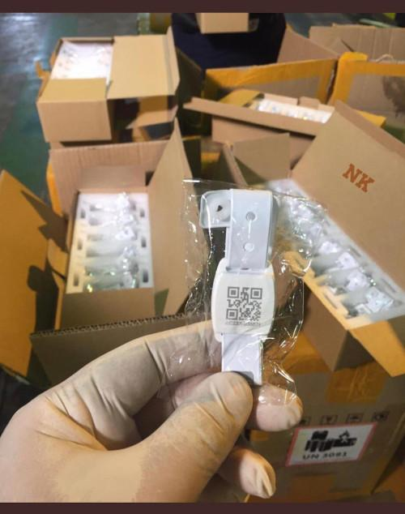

# Shlonik - شلونك‎

In April, the Ministry of Health of Kuwait has launched an app called "Shlonik" in order to monitor the spread of COVID-19 and assist quarantined individuals. It is written in JavaScript using [Apache Cordova](https://cordova.apache.org). It is available for both [Android](https://play.google.com/store/apps/details?id=com.healthcarekw.app&hl=en_US) and [iOS](https://apps.apple.com/kw/app/shlonik-%D8%B4%D9%84%D9%88%D9%86%D9%83/id1503978984). At the time of writing, the Android app counts 10'000+ downloads.

Following is the [self-described](https://play.google.com/store/apps/details?id=com.healthcarekw.app) functionality of the app:

> Shlonik is an interactive app used to assist the Ministry of Health in Kuwait to engage with all citizens and residents and ensure their safety with focus on COVID-19 pandemic.
>
> Shlonik offers a variety of features such as the latest health updates, a health Bot, a self check-in mechanism for quarantined patients, vitals reporting and a communication tool with the MOH medical teams.
>
> Shlonik is the combined effort of MOH, the Kuwait Central Agency of Information Technology and Zain.

According to [press reports](http://www.arabtimesonline.com/news/application-to-track-expats-and-kuwaitis/), the app is used to enforce quarantine by regularly checking in on users and requesting immediate response:

> The program will send messages and alerts to the quarantine if it is outside the area of ​​the quarantine or if the phone is left at home in the event that it is not answered within 5 minutes the preventive health team will start taking its actions regarding the one who breaks the quarantine, as a violation of rule a penalty of three months in prison or a fine will be imposed. It exceeds 5000 dinars, or one of these two penalties.

The app seems to be mandatory for reimpatriated citizens, but all are invited to install it.


## Table of contents

<!--ts-->
   * [Summary of findings](#summary-of-findings)
   * [Registration](#registration)
   * [Location tracking](#location-tracking)
      * [OneSignal](#onesignal)
   * [Bluetooth tracking](#bluetooth-tracking)
   * [Bracelet tracking](#bracelet-tracking)
<!--te-->


## Summary of findings

1. The app requires registration with a national ID. The ID number seems to be verified, so an invalid one will fail the registration.
2. **If the device is moving, the app seems to be constantly uploading GPS location coordinates.** If the device is stationary, it will trigger an heartbeat every 5 minutes.
3. The app scans for near-by Bluetooth devices and if it finds one with the correct service UUID, it will **write** to it its own *personId* and the current GPS coordinates and signal strength. Bluetooth events are uploaded every 5 minutes.
4. A bracelet can be paired with the app, and it will check for the bracelet's distance. Status updates are uploaded every 5 minutes.

**Update (11th May 2020):** in the most recent version of the app, the base frequency of the GPS and Bluetooth data acquisition and upload seems to have been increased from 5 to 10 minutes.


## Registration

In order to register an account, the app requires a valid national ID number. This number seems to be validated by the backend, so in order to proceed with the dynamic analysis we had to impersonate the server in our local contained network.

The app will the authenticate to the server by contacting the endpoint `https://moh-prod.azurefd.net/api/login`:

```json
{
   "countryCode": "44",
   "device": {
       "available": true,
       "cordova": "8.1.0",
       "isActive": true,
       "isVirtual": false,
       "manufacturer": "Google",
       "model": "Pixel 2",
       "platform": "Android",
       "serial": "unknown",
       "uuid": "[REDACTED]",
       "version": "9"
   },
   "language": "en",
   "otp": "[REDACTED]",
   "phone": "[REDACTED]"
}
```

The server will return an identifier which is later used as `personId` for future data uploads.


## Location tracking

The app uses transistorsoft's [Cordova Background Geolocation](https://github.com/transistorsoft/cordova-background-geolocation-lt) plugin for tracking GPS coordinates of the user. You can read more about its design philosophy [here](https://github.com/transistorsoft/cordova-background-geolocation-lt/wiki/Philosophy-of-Operation). This is how the service is configured:

```javascript
bgGeo.ready({
  notification: {
    title: "Shlonik",
    text: "Please make sure to open the app to allow for updates"
  },
  debug: false,
  logLevel: bgGeo.LOG_LEVEL_WARNING,
  desiredAccuracy: bgGeo.DESIRED_ACCURACY_HIGH,
  distanceFilter: 20,
  // TODO: add /api to route (will break the old builds. needs backend push)
  url: api.backendUrl + 'locations',
  preventSuspend: true,
  stopOnTerminate: false,
  foregroundService: true,
  heartbeatInterval: 300,
  useSignificantChangesOnly: useSignificantChangesOnly,
  startOnBoot: true,
  autoSync: true,
  params: {
    "personId": personId
  },
  headers: {
    "Authorization": token
  },
}, function (state) {
  console.log('BackgroundGeolocation is configured and ready to use')
  if (!state.enabled) {
    bgGeo.start().then(function () {
      // alert('- BackgroundGeolocation tracking started')
    })
  }
})
```

By leveraging the phone's motion sensors, the plugin is able to determine if the device is **moving** or it is **stationary**. In the first case it will begin aggressively tracking its location and upload (`autoSync: true`) the device's GPS coordinates in JSON format to a central server located at `https://moh-prod.azurefd.net/locations`:

```json
{
    "location": {
        "activity": {
            "confidence": 100,
            "type": "still"
        },
        "battery": {
            "is_charging": true,
            "level": 1
        },
        "coords": {
            "accuracy": 3.9,
            "altitude": 107,
            "heading": -1,
            "latitude": 11.111111111111111,
            "longitude": 11.111111111111111,
            "speed": 0
        },
        "event": "motionchange",
        "extras": {},
        "is_moving": true,
        "mock": true,
        "odometer": 0,
        "timestamp": "2020-05-10T00:00:00.000Z",
        "uuid": "[REDACTED]"
    },
    "personId": "[REDACTED]"
}
```

If the user is registered as in quarantine, the parameter `useSignificantChangesOnly` in the plugin's settings would be set to `true`, reducing the frequency of location updates from constantly to *only* a few times per hour.

If the `BackgroundGeolocation` plugin determines the phone is **stationary**, it will temporarily stop aggressively fetching GPS coordinates, until the device is again on the move. In this case the plugin will trigger only every 5 minutes (as configured with `heartbeatInterval`). This heartbeat is also used by the app to launch Bluetooth scanning.

This consitutes a severe privacy violation. Operators of the app are live monitoring movements of the tens of thousands of people with the app installed.

### OneSignal

It's also worth noting that the app uses an analytics SDK developed by the American company [OneSignal](https://onesignal.com/). It registers the `personId` of the user with the service:

```json
PUT https://onesignal.com/api/v1/players/[REDACTED]

{
    "app_id": "[REDACTED]",
    "tags": {
        "personId": "[REDACTED]"
    }
}
```

And, at least at every launch, the app will share the GPS coordinates of the device to OneSignal:

```json
POST https://onesignal.com/api/v1/players/[REDACTED]/on_session

SDK-Version: onesignal/android/031207
Content-Type: application/json; charset=UTF-8
Host: onesignal.com
Connection: Keep-Alive
Accept-Encoding: gzip

{
    "ad_id": "[REDACTED]",
    "app_id": "[REDACTED]",
    "lat": 11.1111111,
    "loc_acc": 2384.129,
    "loc_bg": true,
    "loc_time_stamp": 1589905118202,
    "loc_type": 0,
    "long": 11.1111111
}
```

According to OneSignal's [marketing material](https://onesignal.com/webinars/product-demo) this is default behavior for all those apps embedding their SDK and which have access to location services. Effectively, the location of Shlonik's users is also automatically shared with the California-based company.


## Bluetooth scanning

The app also uses Bluetooth for contact tracing. However, it does so in a rather unusual way.

The BLE scanning is done using an Apache Cordova plugin called [cordova-plugin-ble-central](https://github.com/don/cordova-plugin-ble-central). Once the service is started, any newly discovered device is added to a list:

```javascript
  onDiscoverDevice: function (device) {
    bluetooth.emitter.emit('device', device)
    bluetooth.devices.push(device)
    console.log('devices discovered', device)
````

When the previously described `BackgroundGeolocation` heartbeat triggers, the function `scanAndSendToAll()` is called:

```javascript
document.addEventListener('deviceready', () => {
  vm.createPeripheralService()
  console.log("[Device Ready BT] ")
  window.BackgroundGeolocation.onHeartbeat((event) => {
    console.log("[onHeartbeat BT] ", event)
    vm.currentLocation = event.location
    vm.scanAndSendToAll()
    vm.lastHeartbeat = new Date()
    traceDataUpload.uploadData()
    bluetooth.flushIgnoredDevices()
  })

}, false)
```

This function will loop through the Bluetooth devices discovered so far, and invoke `connectAndWrite()` (note that it skips devices called "Aman", which is the name of the Bluetooth bracelet this app can be paired with):

```javascript
setTimeout(async () => {
  console.log('starting connecting with devices.....')

  for (let i = 0; i < bluetooth.devices.length; i++) {
    try {
      if (bluetooth.devices[i].name === 'Aman') {
        console.log('Aman device. not checking for BT Tracing..')
        continue
      }
      await bluetooth.connectAndWrite(bluetooth.devices[i].id)
    } catch (err) {
      console.log('caught connectAndWrite error:', err)
    }
  }
  bluetooth.currentState = states.IDLE
}, 12000
```

`connectAndWrite()` implements the atypical exchange of identifiers:

```javascript
if (data.services.findIndex(x => x.toLowerCase() === SERVICE_UUID.toLowerCase()) > -1) {
  console.log('covid service is AVAILABLE on device..')
  // if (bluetooth.onConnectSubscriber) bluetooth.onConnectSubscriber(data, 'write')
  bluetooth.currentState = states.WRITING
  let message = JSON.stringify({
    bluetoothRssi: data.rssi,
    otherPersonId: bluetooth.personId,
    otherPersonLocation: bluetooth.currentLocation
  })
  ble.write(deviceId, SERVICE_UUID, CHARACTERISTIC_UUID, bluetooth.stringToBytes(message), function (data) {
    console.log('write OK! ', data)
    bluetooth.sentMessages = storage.appendOrCreateLocalStorageItems([
      {
        time: new Date(),
        message: message
      }
    ], 'sentMessages')
    resolve()

    if (bluetooth.onWriteSubscriber) bluetooth.onWriteSubscriber(data)
  }, function (err) {
    console.log(JSON.stringify(err))
    reject('error in write', err)

  })
}
```

While most Bluetooth-based contact tracing apps either use a non-connectable advertisement, or use a read-only advertisement other near-by devices can access to fetch an identifier, this app seems to be doing the opposite.

For each near-by device, instead of reading off an identifier, it will **write** to the other device's BLE charactersitic its own signal strength, `personId`, as well as its current GPS coordinates.

The service in fact is created as both readable and writeable:

```javascript
const service = {
  uuid: SERVICE_UUID,
  characteristics: [
    {
      uuid: CHARACTERISTIC_UUID,
      properties: property.WRITE | property.READ,
      permissions: permission.WRITEABLE | permission.READABLE,
      descriptors: [
        {
          uuid: '2901',
          value: 'Switch'
        }
      ]
    }
  ]
}
```

When the scan is completed, it will upload all the *received* messages (so those written by other phones) to the central server:

```javascript
const traceDataUpload = {
  uploadData: async function () {
    console.log('uploading trace data!')
    // get all messages and put them in temporary storage key with upload info
    let messages = storage.getItemsFromLocalStorage('receivedMessages')

    storage.clearLocalStorageForKey('receivedMessages')

    // also clear sent messages.. because why not
    storage.clearLocalStorageForKey('sentMessages')

    storage.appendOrCreateLocalStorageItems(messages, 'receivedMessagesUploadQueue')

    if (messages.length > 0) {
      // upload them in bulk
      try {
        await postContactTraces({traceData: messages})
      } catch (error) {
        console.log('Error while uploading trace data', error)
      }
      // if success remove them from local storage
      storage.clearLocalStorageForKey('receivedMessagesUploadQueue')
      console.log('upload trace data done')
    } else {
      console.log('no items to upload... going back to sleep')
    }
  }
}
```


## Bracelet tracking

Similarly to [Bahrain](../bahrain/), [Kuwait also started requiring individuals in quarantine to wear electronic bracelets](https://www.arabnews.com/node/1661411/middle-east). This app is responsible for tracking the availability of a paired bracelet, and report to the authorities if it disappears from the Bluetooth proximity scanning. In the app's codebase the bracelet is often referred to by the name "Aman", as well as described as "beacon".



*Source: https://www.kuna.net.kw/ArticleDetails.aspx?id=2886637&language=ar*

First the app will look for a bracelet to pair with:

```javascript
ble.connect(device.id, (connectedDevice) => {
  console.log('Connected with beacon', connectedDevice)
  ble.read(device.id, BEACON_MAC_ADDRESS_SERVICE, BEACON_MAC_ADDRESS_CHARACTERISTIC,
      (readResultArrayBuffer) => {
        let macAddress = arrayBufferUtils.bytesToString(readResultArrayBuffer)
        console.log('Found MAC Address ==>', macAddress)
        // is this a beacon we are looking for?
        let bIndex = notFoundBeacons.findIndex(x => x.macAddress === macAddress)
        if (bIndex > -1) {
          console.log('We found a beacon we are looking for! updating')
          notFoundBeacons[bIndex].found = true
          notFoundBeacons[bIndex].id = device.id
          notFoundBeacons[bIndex].dateFound = new Date()
          notFoundBeacons[bIndex].lastSeen = new Date()
          notFoundBeacons[bIndex].rssi = connectedDevice.rssi

          store.state.beaconLastSeen = new Date()
          store.state.beaconRssi = device.rssi
          store.state.beaconId = device.id

          beacon.emitter.emit('beaconFound', macAddress)

          beacon.beaconEvents.push({
            id: device.id,
            macAddress: macAddress,
            appeared: true,
            time: new Date()
          })
        }
        // notFoundBeacons[i].macAddress =
      },
      beacon.onReadError)
}, beacon.onConnectError)
```

Then it checks if the bracelet is indeed in the proximity of the phone. If not, it will raise an alert:

```javascript
confirmTrackedBeaconsVisibility: () => {
  // we save the last scan time and check that all tracked and found beacons are visible
  // if not we need to raise a (beacon disappeared) event
  console.log('checking for visibility in 5 seconds')
  setTimeout(() => {
    console.log('checking for visibility!')
    let foundAndTracked = beacon.trackedBeacons.filter(x => x.found)
    for (let i = 0; i < foundAndTracked.length; i++) {
      let scanTime = DateTime.fromJSDate(beacon.lastScan)
      let lastSeen = DateTime.fromJSDate(foundAndTracked[i].lastSeen)

      let diff = Math.abs(scanTime.diff(lastSeen, 'seconds').seconds)
      console.log(diff)

      // we haven't seen this beacons in X seconds
      if (diff > 30 && foundAndTracked[i].appeared) {
        foundAndTracked[i].appeared = false
        store.state.isBeaconVisible = false
        let beaconAppeared = {
          id: foundAndTracked[i].id,
          appeared: false,
          time: new Date()
        }
        beacon.emitter.emit('beacon', beaconAppeared)
        beacon.beaconEvents.push(beaconAppeared)
      } else if (!foundAndTracked[i].appeared) {
        foundAndTracked[i].appeared = true
        store.state.isBeaconVisible = true
        let beaconDisappeared = {
          id: foundAndTracked[i].id,
          appeared: true,
          time: new Date()
        }
        beacon.emitter.emit('beacon', beaconDisappeared)
        beacon.beaconEvents.push(beaconDisappeared)
      }

    }
  }, 5000)
},
```

If a bracelet is registered, the following details are then regularly sent to the central server at `https://moh-prod.azurefd.net/api/beacon/event`:

```javascript
api.sendBeaconEvent({
  beaconLastScan: state.beaconLastScan,
  beaconLastSeen: state.beaconLastSeen,
  beaconRssi: state.beaconRssi,
  beaconMacAddress: state.beaconMacAddress,
  BeaconType: state.beaconType
})
```
