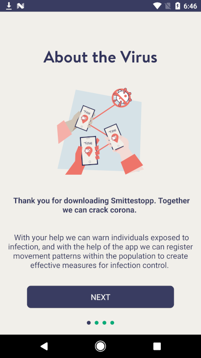
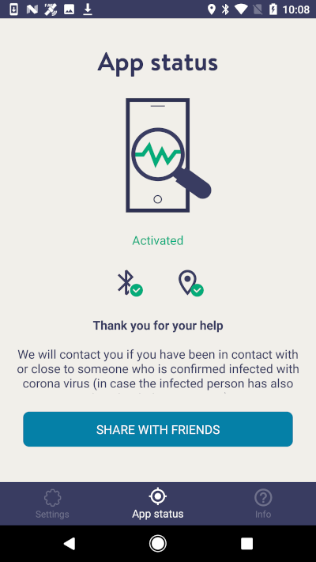

# Smittestopp

Norway launched an app called "Smittestopp" as a contact-tracing solution for COVID-19. It is available both on [Android](https://play.google.com/store/apps/details?id=no.simula.smittestopp) and [iOS](https://apps.apple.com/no/app/smittestopp/id1506165384). At the time of writing, the Android app counts 100'000+ installations. [News articles](https://www.forbes.com/sites/davidnikel/2020/04/25/norway-14-million-people-download-coronavirus-tracking-app-despite-security-concerns/) report that total downloads reached nearly 1.5 millions.

 


## Table of contents

<!--ts-->
   * [Summary of findings](#summary-of-findings)
   * [Registration](#registration)
   * [Location tracking](#location-tracking)
   * [Bluetooth tracking](#bluetooth-tracking)
   * [Data upload](#data-upload)
<!--te-->


## Summary of findings

1. The app **requires registration with a valid phone number**. Although no other information is required, any data uploads would be tied to it. Phone numbers could be used by relevant authorities to potentially deanonymize users, if provided with the legal authority to do so.
2. The app **records and uploads GPS location data** as soon as sufficient distance has been covered. The app is therefore capable of accurately tracking geographical movements of all users of Smittestopp.
3. Smittestopp also conducts Bluetooth-based contact tracing. Apps running on devices in the proximity will exchange the respective unique identifiers and store them locally, along with a timestamp and signal strength. These records are also uploaded to the central server.
4. **The device identifier is static**, and therefore **could be potentially used for tracking users' movements** using Bluetooth sensors.
5. The app uses [Microsoft Azure IoT Hub](https://azure.microsoft.com/en-us/services/iot-hub/). **All data is uploaded to Microsoft's servers**, seemingly in Ireland.


## Registration

Upon installation the user will be required to provide a valid phone number that is used for an OTP verification. The phone number is also used by the app registers with the IoT Hub backend, which will respond with connection details, a unique device identifier and an access key:

```json
{
    "ConnectionString": "HostName=iot-smittestopp-prod.azure-devices.net;DeviceId=[REDACTED];SharedAccessKey=[REDACTED]",
    "DeviceId": "[REDACTED]",
    "HostName": "iot-smittestopp-prod.azure-devices.net",
    "PhoneNumber": "+[REDACTED PHONE NUMBER]",
    "SharedAccessKey": "[REDACTED]"
}
```

The device identifier is stored locally and later used for any data upload.

It is likely, although not possible to prove, that phone numbers are then permanently tied to the static device identifier which is sent by the app along with tracking data to the server. Particularly because national IDs or passports are required to purchase a SIM card in Norway, it is not possible to guarantee anonymity of Smittestopp users.


## Location tracking

The app uses Android's [Location](https://developers.google.com/android/reference/com/google/android/gms/location/package-summary) interface in order to listen to GPS location updates and store a local copy of the device's movements.

```java
timber.a.a.d.c('(' + var_location.getLatitude() + ", " + var_location.getLongitude() + "), accuracy: " + var_location.getAccuracy(), new Object[0]);
long v7 = var_location.getTime() / 1000L;
double v2 = var_location.getLatitude();
double v4 = var_location.getLongitude();
double v9 = (double)var_location.getAccuracy();
double v11 = var_location.getAltitude();
double v13 = (double)var_location.getSpeed();
```

These GPS records are locally stored on the device in a SQLCipher database, in a table named `MEASUREMENT` created by the following snippet of code upon install:

```java
arg5.execSQL("CREATE TABLE \"MEASUREMENT\" (\"_id\" INTEGER PRIMARY KEY AUTOINCREMENT ,\"TIMESTAMP\" INTEGER,\"LATITUDE\" REAL,\"LONGITUDE\" REAL,\"LAT_LONG_ACCURACY\" REAL,\"ALTITUDE\" REAL,\"ALTITUDE_ACCURACY\" REAL,\"SPEED\" REAL,\"SPEED_ACCURACY\" REAL,\"IS_UPLOADED\" INTEGER);");
```

After a sufficient spacial distance has been covered, the app will upload existing records to Microsoft Azure IoT Hub, tied to the device identifier retrieved at registration:

```
POST https://iot-smittestopp-prod.azure-devices.net/devices/[DEVICE IDENTIFIER]/messages/events?api-version=2018-06-30

{
  "appVersion": "1.1.1",
  "platform": "android",
  "osVersion": "[ANDROID VERSION]",
  "model": "[PHONE MODEL]",
  "events": [
    {
      "timeFrom": "2020-05-12T00:00:00Z",
      "timeTo": "2020-05-12T00:00:00Z",
      "latitude": 11.111111111111111,
      "longitude": 11.111111111111111,
      "accuracy": 2.000000000000000,
      "altitude": 11.111111111111111,
      "altitudeAccuracy": -1,
      "speed": 0.2000000000000000,
      "speedAccuracy": -1
    },

    ...

    {
      "timeFrom": "2020-05-12T00:00:00Z",
      "timeTo": "2020-05-12T00:00:00Z",
      "latitude": 11.111111111111111,
      "longitude": 11.111111111111111,
      "accuracy": 2.000000000000000,
      "altitude": 11.111111111111111,
      "altitudeAccuracy": -1,
      "speed": 0.2000000000000000,
      "speedAccuracy": -1
    }
  ]
}
```

The live tracking of GPS latitude, longitude, altitude, speed, and timeframe provide the operators of this app with a precise view of Smittestopp's users movements. This might constitute a severe violation to the right to privacy.


## Bluetooth tracking

In addition to GPS tracking, Smittestopp also attempts to conduct Bluetooth-based contact tracing. Devices equipped with Smittestopp will continuously scan for near-by devices exposting a BLE GATT/GAP service with the provided Smittestopp service UUID, read the device identifier and recording the encounter.

The BLE service is set up and advertised as following:

```java
public class_bleAdvertiserBuilder(BluetoothLeAdvertiser btAdvertiser) {
    this.btAdvertiser = btAdvertiser;
    AdvertiseData advertiseData = new AdvertiseData.Builder().addServiceUuid(new ParcelUuid(class_myPreferences.serviceUUID)).setIncludeDeviceName(false).setIncludeTxPowerLevel(true).build();
    class_someUtils.func_someException(advertiseData, "AdvertiseData.Builder()\n…rue)\n            .build()");
    this.btAdvertiseData = advertiseData;
    AdvertiseSettings advertiseSettings = new AdvertiseSettings.Builder().setAdvertiseMode(0).setConnectable(true).setTimeout(0).setTxPowerLevel(2).build();
    class_someUtils.func_someException(advertiseSettings, "AdvertiseSettings.Builde…IUM)\n            .build()");
    this.btAdvertiseSettings = advertiseSettings;
    this.btAdvertiseCallback = new class_btAdvertiseCallback();
}
```

The service has UUID `e45c1747-a0a4-44ab-8c06-a956df58d93a` and the characteristic containing the device identifier has UUID `64b81e3c-d60c-4f08-8396-9351b04f7591`.

When a near-by device wants to register a contact with a user's device it will request the unique device identifier by connecting to the observed service. Smittestopp BLE service will then respond as defined in the following function:

```java
 public void onCharacteristicReadRequest(BluetoothDevice arg11, int arg12, int arg_readSize, BluetoothGattCharacteristic arg_gattCharacteristic) {
    if(arg11 != null) {
        if(arg_gattCharacteristic != null) {
            if((c.a(arg_gattCharacteristic)) && this.obj_bluetoothInstance.btGattServer != null) {
                if(arg_readSize == 0) {
                    StringBuilder v2 = a.a("Requesting characteristic UUID: ");
                    v2.append(arg_gattCharacteristic.getUuid());
                    timber.a.a.d.a(v2.toString(), new Object[0]);
                    timber.a.a.d.a("Responding: + " + new String(this.obj_bluetoothInstance.var_deviceIdBytes, class_getCharset.a), new Object[0]);
                }

                class_bluetoothInstance obj_btInstance = this.obj_bluetoothInstance;
                byte[] var_deviceIdBytes = obj_btInstance.var_deviceIdBytes;
                if(arg_readSize > var_deviceIdBytes.length) {
                    BluetoothGattServer obj_gattServer = obj_btInstance.btGattServer;
                    if(obj_gattServer != null) {
                        obj_gattServer.sendResponse(arg11, arg12, 0, 0, new byte[0]);
                        return;
                    }

                    class_someUtils.a();
                    throw null;
                }

                byte[] v8 = new byte[var_deviceIdBytes.length - arg_readSize];
                int v1;
                for(v1 = arg_readSize; v1 < var_deviceIdBytes.length; ++v1) {
                    v8[v1 - arg_readSize] = this.obj_bluetoothInstance.var_deviceIdBytes[v1];
                }

                BluetoothGattServer v3 = this.obj_bluetoothInstance.btGattServer;
                if(v3 != null) {
                    v3.sendResponse(arg11, arg12, 0, arg_readSize, v8);
                    return;
                }

                class_someUtils.a();
                throw null;
            }

            return;
        }

        class_someUtils.func_getStackTrace("characteristic");
        throw null;
    }

    class_someUtils.func_getStackTrace("device");
    throw null;
}
```

**Because the device identifiers exchanged over Bluetooth is static and does not rotate, an attacker with at their disposal a distributed network of Bluetooth sensors, could potentially track users' movements around a city.**

Bluetooth contact recorded by Smittestopp are stored locally in a SQLCipher table called `BLUETOOTH_CONTACT` and created at installation like following:

```java
arg5.execSQL("CREATE TABLE \"BLUETOOTH_CONTACT\" (\"_id\" INTEGER PRIMARY KEY AUTOINCREMENT ,\"TIMESTAMP\" INTEGER,\"DEVICE_ID\" TEXT,\"RSSI\" INTEGER NOT NULL ,\"TX_POWER\" INTEGER NOT NULL ,\"IS_UPLOADED\" INTEGER);");
```
These records are eventually uploaded by the app to the central server.


## Data upload

Smittestopp uploads both GPS and Bluetooth events to [Azure IoT Hub](https://azure.microsoft.com/en-us/services/iot-hub/), a cloud-hosted solution offered by Microsoft intended for management of IoT devices. The server in use by Smittestopp is `iot-smittestopp-prod.azure-devices.net`, which appears to be located in Microsoft's datacenter in Dublin, Ireland. The connection to the service is configured as following:

```java
DeviceClient obj_deviceClient = new DeviceClient(var_prefConnectionData, IotHubClientProtocol.HTTPS);
obj_deviceClient.setRetryPolicy(k.b.a.g.a);
obj_deviceClient.registerConnectionStatusChangeCallback(new f(this), null);
obj_deviceClient.setOperationTimeout(1000L);
obj_deviceClient.setOption("SetMinimumPollingInterval", Long.valueOf(1800000L));
obj_deviceClient.open();
obj_deviceClient.setMessageCallback(new class_iotHubMessageCallback(this), null);
```

Both "gps" and "bluetooth" events that were stored locally are then regularly uploaded to IoT Hub:

```java
public void func_sendTrackingEvents(class_events arg_events) {
    if(arg_events == null) {
        return;
    }

    DataCollectorService.func_sendIoTHubEvent(this.obj_dataCollectorService, "gps", arg_events.locationEventsList);
    DataCollectorService.func_sendIoTHubEvent(this.obj_dataCollectorService, "bluetooth", arg_events.bluetoothEventsList);
}
```

The upload task is executed as following:

```java
public static final void func_sendIoTHubEvent(DataCollectorService var_collector, String var_eventType, class_list arg_list) {
    if(var_collector != null) {
        int var_listSize = arg_list.a.size();
        int var_indexZero = 0;
        while(var_indexZero < var_listSize) {
            i.c v4 = (i.c)arg_list.a.get(var_indexZero);
            List var_listEvents = (List)v4.x;
            JSONObject obj_jsonObject = (JSONObject)v4.y;
            if(obj_jsonObject.length() > 0 && obj_jsonObject.getJSONArray("events").length() > 0) {
                Message obj_message = new Message(obj_jsonObject.toString());
                obj_message.setProperty("eventType", var_eventType);
                class_iotHubConnector obj_iotHubConnector = var_collector.obj_iotHubConnector;
                if(obj_iotHubConnector == null) {
                    class_someUtils.func_throwSomeException("mDevice");
                    throw null;
                }

                class_iotHubEvent obj_iotHubEvent = new class_iotHubEvent(var_collector, var_eventType, var_listEvents);
                if((obj_iotHubConnector.var_isConnectorSetUp) && obj_iotHubConnector.obj_deviceClient != null) {
                    if((class_someUtils.func_areEquals(obj_message.getContentType(), obj_iotHubConnector.var_applicationJson) ^ 1) != 0) {
                        obj_message.setContentTypeFinal(obj_iotHubConnector.var_applicationJson);
                    }

                    if((class_someUtils.func_areEquals(obj_message.getContentEncoding(), obj_iotHubConnector.var_utf8) ^ 1) != 0) {
                        obj_message.setContentEncoding(obj_iotHubConnector.var_utf8);
                    }

                    try {
                        DeviceClient obj_deviceClient = obj_iotHubConnector.obj_deviceClient;
                        if(obj_deviceClient != null) {
                            obj_deviceClient.sendEventAsync(obj_message, obj_iotHubEvent, null);
                        }

                        timber.a.a.d.c("Pushed message", new Object[0]);
                    }
```
