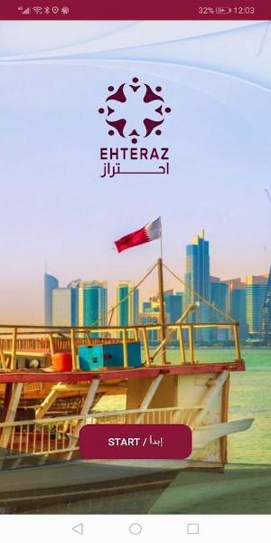
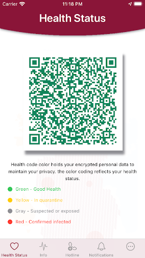

# EHTERAZ

Since end of April, the Ministry of Interior of Qatar started making available a COVID-19 app called EHTERAZ. The app is available on both [iOS](https://apps.apple.com/us/app/ehteraz/id1507150431) and [Android](https://play.google.com/store/apps/details?id=com.moi.covid19&hl=en_US). On May 19th, the Qatari authorities announced that from May 22nd the app would be mandatory for all Qatari citizens and residents, and those found without it could face up to three years in prison and a fine of QR200,000 (approximately $55'000).



*Source: [Google Play Store](https://play.google.com/store/apps/details?id=com.moi.covid19)*

On May 20th, Amnesty International's Security Lab started analyzing EHTERAZ and found extremely worrying issues which led to the exposure of personal data of all users of the app. As of May 21st, the Android version alone counted more than 500'000 downloads. One day later it well passed 1'000'000. Amnesty International immediately alerted the authorities, and on May 24th the Ministry of Interior of Qatar released a new version of the app which should mitigate some of the issues we identified. The description of the technical findings are made available here as a cautionary tale for other similar efforts rushing the development apps treating very sensitive data.


## Table of contents

<!--ts-->
   * [Summary of findings](#summary-of-findings)
   * [Exposure of personal information](#exposure-of-personal-information)
   * [Location tracking](#location-tracking)
      * [Confinement monitor](#confinement-monitor)
   * [Bluetooth tracking](#bluetooth-tracking)
      * [Transmitter](#transmitter)
      * [Scanner](#scanner)
<!--te-->


## Summary of findings

1. The app requires registration using a valid Qatari phone number and a valid Qatari national ID number.
2. The app retrieves a colored QR code from the central server using a REST API. The response contains personal information of the user including the national ID, the English and Arabic names, the designated confinement location (presumably their home), the name of the medical facility if the user is diagnosed and in isolation. The generated QR code is scanned by police patrols and checkpoints throughout Qatar to enforce quarantine measures.
3. Because the central server did not require any proper authentication and did not enforce any rate limiting, **it was possible to retrieve the QR code and additional personal information of any EHTERAZ user**. *2020-05-24 Update: Amnesty International informed the Qatari authorities about this issue on May 21st. On May 24th the Ministry of Interior of Qatar issued an update to the app introducing some API key-based authentication which should mitigate this problem.*
4. The app conducts Bluetooth-based contact tracing, and automatically uploads all records along with the date and time, and the GPS coordinates of the phone when the contact happened. **Authorities are therefore able to monitor the time and location of encounters between EHTERAZ users.**
5. **The app is capable of conducting location tracking for the entire user-base or for specifically selected individuals.** At the time of writing, this functionality appears to be **disabled by default**, but it could be enabled at any time through a simple update of the configuration over API.


## Exposure of personal information

***2020-05-24 Update:** Amnesty International informed the Qatari authorities about this issue on May 21st. On May 24th the Ministry of Interior of Qatar issued an update to the app introducing some API key-based authentication which should mitigate this problem.*

After launching and successfully registering with EHTERAZ using a valid Qatari phone number and national ID, the app's main view will display a colored QR code which should indicate the "health status" of the user. News reports suggest that these QR code are regularly being scanned by police patrols and checkpoints throughout Qatar.



*Source: [Google Play Store](https://play.google.com/store/apps/details?id=com.moi.covid19)*

In the background, the app fetches the QR code from the central server by simply providing the Qatari national ID the user provided at registration. At the time of the discovery of this issue, the server answered with a message in the following format:

```json
{
  "status": "true",
  "message": "QR generated successfully",
  "qrcode": "<imageXML><QID>[REDACTED]</QID><CFLG>1</CFLG><fac>[REDACTED]</fac><LAT>[REDACTED]</LAT><LONG>[REDACTED]</LONG></imageXML>",
  "nameEng": "[REDACTED]",
  "nameAr": "[REDACTED]",
  "color": "#FF0000"
}
```

**The response contained the QR code string, English and Arabic name of the person associated with the provided ID number, and an HTML color which will be either red, yellow, gray or green to indicate the person's health status. The QR code string in addition contains the ID, a flag indicating whether the person should be in confinement, the latitude and longitude of the person's designated confinement location. If the person is being treated in isolation, the QR code would even contain the name of the medical facility.**

A lot of very personal information was contained within this API response.

The fundamental issue was that the server did not require any form of authentication other than a valid Qatari national ID number, and dud not seem to enforce any rate limiting. It was therefore possible to request any number of valid Qatari national ID numbers and retrieve the personal information described above of potentially all users of EHTERAZ.

Qatari national ID numbers are composed of 11 digits using the following format:

```
XYYZZZCCCCC
```

Where:

- `X` is either `2` or `3` indicating the person is born either before or after the year 2000.
- `YY` are the last two digits of the year of birth of the person.
- `ZZZ` is the UN M49 country code, indicating the nationality of the person.
- `CCCCC` is a 5 digits sequential counter of the number of people of the same nationality and birth year who obtained residency in Qatar.

Obviously, the predictable nature of this format could further simplify enumeration.

In order to verify this issue, we managed to access the QR codes of a small sample of EHTERAZ users. We promptly disposed of any information we collected.

The same enumeration could be conducted on other API endpoints other than the QR code. For example, an attacker could learn whether any given user should be in confinement and where, and whether their phone's location is being tracked (as discussed in the [Location tracking](#location-tracking) section of this document).


## Location tracking

Upon launch and successful registration, EHTERAZ requests the user to grant various permissions, including access to the GPS. If the user agrees, the app will run either `HuaweiLocationService` or `GoogleLocationManager` depending on the detected manufacturer of the device.

These services regularly check whether they should fetch and record a new GPS location if in the app's configuration either `EnableGeoTracing` or `EnablePersonalGeoTracing` are set to "*true*":

```java
if(Configurations.EnableGeoTracing) {
    if(Configurations.DisableGeoTracing) {
        Log.d(this.TAG, "Logging Location not required. forcing creation of a new row later");
        SplashActivity.lastLat = v2;
    }
    else {
        Log.d(this.TAG, "Updating GEO");
        double v0 = this.getDistance(SplashActivity.Latittude, SplashActivity.lastLat, SplashActivity.Longitude, SplashActivity.lastLong);
        Log.d(this.TAG, "" + v0);
        if(v0 > ((double)Configurations.distanceThr)) {
            DBAccess.logUpdateLocation(SplashActivity.Longitude, SplashActivity.Latittude);
            SplashActivity.lastLong = SplashActivity.Longitude;
            SplashActivity.lastLat = SplashActivity.Latittude;
        }
    }
}
else if(Configurations.EnablePersonalGeoTracing) {
    Log.d(this.TAG, "Updating GEO");
    double v0_1 = this.getDistance(SplashActivity.Latittude, SplashActivity.lastLat, SplashActivity.Longitude, SplashActivity.lastLong);
    Log.d(this.TAG, "" + v0_1);
    if(v0_1 > ((double)Configurations.distanceThr)) {
        DBAccess.logUpdateLocation(SplashActivity.Longitude, SplashActivity.Latittude);
        SplashActivity.lastLong = SplashActivity.Longitude;
        SplashActivity.lastLat = SplashActivity.Latittude;
    }
}
```

`EnableGeoTracing`'s value is provided by a configuration the app regularly fetches from the central server at `https://ehtraz.com/BioTrace/api/BioTrace/getConfigurationObfuscated`. At the time of writing this is the configuration the server returns:

```json
{
  "status": "true",
  "message": "Config from DB",
  "configObj": [
    {
      "configName": "THRESHOLD",
      "configValue": "2"
    },
    {
      "configName": "N",
      "configValue": "3"
    },
    {
      "configName": "syncFrequency",
      "configValue": "180"
    },
    {
      "configName": "scanTime",
      "configValue": "1"
    },
    {
      "configName": "scanFrequency",
      "configValue": "300"
    },
    {
      "configName": "confinementPerimeter",
      "configValue": "50"
    },
    {
      "configName": "timeToLogBreachAgain",
      "configValue": "60"
    },
    {
      "configName": "DevicesTimeoutParameter",
      "configValue": "10"
    },
    {
      "configName": "DeviceUpdateFrequency",
      "configValue": "15"
    },
    {
      "configName": "DistanceThresholdForGeoloc",
      "configValue": "50"
    },
    {
      "configName": "UserVariablesUpdateInterval",
      "configValue": "10"
    },
    {
      "configName": "HeartBeatTimeInterval",
      "configValue": "60"
    },
    {
      "configName": "TimeToLogOffInterval",
      "configValue": "15"
    },
    {
      "configName": "AllSyncInterval",
      "configValue": "2"
    },
    {
      "configName": "EnableGeoTracing",
      "configValue": "false"
    },
    {
      "configName": "PersonInfoFrequency",
      "configValue": "60"
    },
    {
      "configName": "retryFrequency",
      "configValue": "10"
    }
  ]
}
```

As you can see `EnableGeoTracing` is currently set to "*false*". **The operators of the EHTERAZ server could enable at any time location tracking for all users of the app at once, by changing this flag to "*true*".** Interestingly, the operators are also able to enable location tracking for specific individuals by changing the `EnablePersonalGeoTracing` flag which is instead retrieved by the app by sending the user's national ID to `https://ehtraz.com/BioTrace/api/BioTrace/getPeronGeoStatus`:

```json
{
  "status": "true",
  "message": "getPeronGeoStatus successfull",
  "EnableGeoTracing": 0,
  "disableGeoTracing": 0,
  "isStatusChanged": 0
}
```

If either the global or personal location tracking are enabled, the app will regularly upload the GPS coordinates of the device to the server at `https://ehtraz.com/BioTrace/api/BioTrace/publishGeoLocObfuscated` in the following format (where `var1` is longitude and `var2` is latitude):

```json
{
    "var1": "11.1111111111111",
    "var2": "11.111111111111111",
    "var3": "0",
    "var4": "2020-05-20T00:00:00",
    "var5": "2020-05-20T00:00:00",
    "var6": "0",
    "var7": "0",
    "var8": "A"
}
```

### Confinement monitor

The phone's location is also used in case someone is expected to be in isolated quarantine. The app contacts `https://ehtraz.com/BioTrace/api/BioTrace/getPersonStatusObfuscated` which responds with the following message format:

```json
{
  "status": "true",
  "message": "Get data successfull",
  "QID": "[REDACTED]",
  "confinementFlag": 1,
  "confinementLongitude": 11.11111111,
  "confinementLatitude": 11.1111111
}
```

If `confinementFlag` is set to `1`, the user is expected to be in quarantine at the location provided by `confinementLongitude` and `confinementLatitude` (supposedly their home address). EHTERAZ then makes sure the user remains within a certain perimeter from the designated location. If not, the app will alert the authorities:

```java
if(Configurations.confFlag == 1 && Configurations.perimeter > 0) {
    double v0_2 = this.getDistance(SplashActivity.Latittude, Configurations.confLat, SplashActivity.Longitude, Configurations.confLong);
    Log.d(this.TAG, "Distance for breach: " + v0_2);
    if(v0_2 > ((double)Configurations.perimeter)) {
        DBAccess.logBreach(SplashActivity.Longitude, SplashActivity.Latittude);
    }
}
```


## Bluetooth tracking

EHTERAZ uses Bluetooth Low Energy (BLE) beacons in order to conduct digital contact tracing of the app's users. In order to do so, it runs in parallel a transmitter and a scanner:

```java
BLETransmitter v6 = new BLETransmitter(v7);
v6.keepTransmitting();
BLEScanner v5 = new BLEScanner(v7);
v5.startBeaconScan();
```

### Transmitter

EHTERAZ's BLE transmitting feature is implemented in a class called `BLETransmitter`. When initialized, three beacons are created with distinct UUIDs. A default beacon with UUID `4f726269-7353-7973-4265-61636f6e3031`, a `beaconYellow` with UUID `4f726269-7353-7973-4265-61636f6e3032`, and a `beaconRed` with UUID `4f726269-7353-7973-4265-61636f6e3033`:

```java
this.beacon = new Builder().setId1("4f726269-7353-7973-4265-61636f6e3031").setId2(DBAccess.getMajor(this.mContext)).setId3(DBAccess.getMinor(this.mContext)).setManufacturer(76).setTxPower(-69).setDataFields(Arrays.asList(new Long[]{((long)0L)})).build();
this.beaconYellow = new Builder().setId1("4f726269-7353-7973-4265-61636f6e3032").setId2(DBAccess.getMajor(this.mContext)).setId3(DBAccess.getMinor(this.mContext)).setManufacturer(76).setTxPower(-69).setDataFields(Arrays.asList(new Long[]{((long)0L)})).build();
this.beaconRed = new Builder().setId1("4f726269-7353-7973-4265-61636f6e3033").setId2(DBAccess.getMajor(this.mContext)).setId3(DBAccess.getMinor(this.mContext)).setManufacturer(76).setTxPower(-69).setDataFields(Arrays.asList(new Long[]{((long)0L)})).build();
this.btManager = (BluetoothManager)this.mContext.getSystemService("bluetooth");
this.btAdapter = this.btManager.getAdapter();
BLETransmitter.beaconTransmitter = new BeaconTransmitter(this.mContext, new BeaconParser().setBeaconLayout("m:2-3=0215,i:4-19,i:20-21,i:22-23,p:24-24"));
BLETransmitter.beaconTransmitterRed = new BeaconTransmitter(this.mContext, new BeaconParser().setBeaconLayout("m:2-3=0215,i:4-19,i:20-21,i:22-23,p:24-24"));
BLETransmitter.beaconTransmitterYellow = new BeaconTransmitter(this.mContext, new BeaconParser().setBeaconLayout("m:2-3=0215,i:4-19,i:20-21,i:22-23,p:24-24"));
```

Note that beacons are also provided a `Major` and `Minor`, which are identifiers retrieved by the app upon registration and therefore tied to the user's national ID.

Every minute (as defined by `BLUETOOTH_CHECK_TIMER = 60000`), the app transmits one of the beacons defined above selected depending on the color of the QR code the app retrieves from the central server, as described earlier. In case the color is `#ffca3c` (hexadecimal representation of yellow/orange) it broadcasts `beaconYellow`. If the color is `#ff0000` (hexadecimal representation of red), it broadcasts `beaconRed`. Otherwise it uses the default `beacon`:

```java
if(Configurations.color.equalsIgnoreCase("ffca3c")) {
    Log.d(this.TAG, "Trasmitting Presence + Yellow");
    if(!this.alternateYellow) {
        BLETransmitter.mHandler.removeCallbacksAndMessages(null);
        BLETransmitter.mHandler1.removeCallbacksAndMessages(null);
        BLETransmitter.stopALL();
        BLETransmitter.mHandler1.postDelayed(new Runnable() {
            @Override
            public void run() {
                BLETransmitter v0 = BLETransmitter.this;
                v0.alternateYellow = true;
                v0.alternateRed = false;
                v0.transmitYellowTimed(v0.alternationBroadcast);
            }
        }, ((long)this.alternationTimer));
        return;
    }
}
else if(Configurations.color.equalsIgnoreCase("ff0000")) {
    if(BLETransmitter.beaconTransmitterYellow.isStarted()) {
        BLETransmitter.beaconTransmitterYellow.stopAdvertising();
    }

    Log.d(this.TAG, "Trasmitting Presence + Red");
    if(!this.alternateRed) {
        BLETransmitter.mHandler.removeCallbacksAndMessages(null);
        BLETransmitter.mHandler1.removeCallbacksAndMessages(null);
        BLETransmitter.stopALL();
        BLETransmitter.mHandler1.postDelayed(new Runnable() {
            @Override
            public void run() {
                BLETransmitter v0 = BLETransmitter.this;
                v0.alternateRed = true;
                v0.alternateYellow = false;
                v0.transmitRedTimed(v0.alternationBroadcast);
            }
        }, ((long)this.alternationTimer));
        return;
    }
}
else {
    Log.d(this.TAG, "Only Presence trasnmition");
    BLETransmitter.mHandler.removeCallbacksAndMessages(null);
    BLETransmitter.mHandler1.removeCallbacksAndMessages(null);
    BLETransmitter.stopALL();
    BLETransmitter.mHandler1.postDelayed(new Runnable() {
        @Override
        public void run() {
            BLETransmitter v0 = BLETransmitter.this;
            v0.alternateRed = false;
            v0.alternateYellow = false;
            v0.transmitPermanent();
        }
    }, ((long)this.alternationTimer));
}
```


### Scanner

In parallel to its own transmitter, the app also scans for nearby Bluetooth devices to identify other EHTERAZ users. The app uses the service UUID described earlier to determine the health status of the nearby user:

```java
if((v3.equalsIgnoreCase("4C000215")) && (v1.equalsIgnoreCase("4f726269-7353-7973-4265-61636f6e3031"))) {
    BLEScanner.this.addScanResult(arg8, v0_3);
    continue;
}

if((v3.equalsIgnoreCase("4C000215")) && (v1.equalsIgnoreCase("4f726269-7353-7973-4265-61636f6e3032"))) {
    BLEScanner.sLogger.info("YELLOW");
    BLEScanner.this.addScanResultYellow(arg8, v0_3);
    continue;
}

if(!v3.equalsIgnoreCase("4C000215") || !v1.equalsIgnoreCase("4f726269-7353-7973-4265-61636f6e3033")) {
    continue;
}

BLEScanner.sLogger.info("RED");
BLEScanner.this.addScanResultRed(arg8, v0_3);
```

The proximity to the scanned device is determined by the Received Signal Strength Indication (RSSI). If the RSSI value is higher than a minimum threshold of -53 dBm, EHTERAZ considers this to be a *contact*.

Any detected *contacts* are then stored in the local database in three distinct tables called `logs`, `logsYellow`, `logsRed`, depending on the identified health status of the nearby user. Each record includes the longitude, latitude, the detected distance from the nearby Bluetooth device, the time range, and `Minor` and `Major` values which identify the device:

```java
SQLiteStatement v1_3 = DBAccess.database.compileStatement("insert into logs (LONGITUDE, LATITUDE, DISTANCE, TIME_IN, TIME_OUT, Minor, Major, ToSync) values (?, ?, ?, datetime(?), datetime(?), ?, ?, ?)");
v1_3.bindDouble(1, SplashActivity.Longitude);
v1_3.bindDouble(2, SplashActivity.Latittude);
v1_3.bindDouble(3, v4);
v1_3.bindString(4, v0_1.date);
v1_3.bindString(5, v0_1.date);
v1_3.bindLong(6, ((long)v0_1.Minor));
v1_3.bindLong(7, ((long)v0_1.Major));
v1_3.bindLong(8, 1L);
v1_3.executeInsert();
Log.d(DBAccess.TAG, "Added To DB");
```

In a separate thread, `SyncDataToWS` regularly uploads data stored locally in the logs database tables to the central server at the URL `https://ehtraz.com/BioTrace/api/BioTrace/publishInfoObfuscated`. **Authorities are therefore able to observe any contact between EHTERAZ users and the GPS location of the encounter.**

At the same time, the app alerts the user with a notification in case of potential exposure:

```java
Builder v0_1 = new Builder(this.mContext, "notification_id").setSmallIcon(0x7F0800BC).setCategory("msg").setContentTitle("Proximity").setContentText(v0 ? "Warning. You are in proximity of an infected person" : "‪إنتبه أنت بالقرب من شخص مصاب‬").setPriority(2).setDefaults(1).setAutoCancel(false).setContentIntent(v2_1).setVisibility(1).addAction(0x7F0800BC, v0 ? "OK" : "OK", v2_1);  // drawable:ic_app_plain
```
