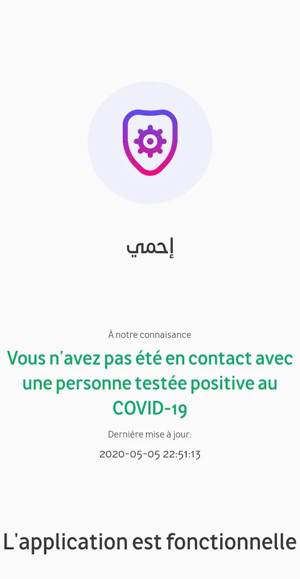
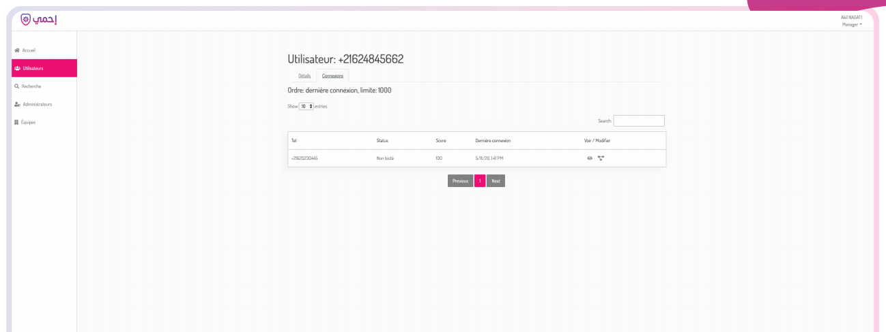

# E7mi

Tunisia's Ministry of Health launched two applications during the pandemic. The first one ["Co-Vivre-20"](https://play.google.com/store/apps/details?id=com.satoripop.covid_android) was launched in April in order to monitor people in quarantine. In May, they released a second app called E7mi (arabic for "protect") to do contact tracing. The app is available for both [Android](https://play.google.com/store/apps/details?id=tn.onmne.e7mi) and [iOS](https://apps.apple.com/us/app/e7mi-%D8%A5%D8%AD%D9%85%D9%8A/id1513856060#?platform=iphone).



*Screenshot of the app from Google Play Store*


## Table of contents

<!--ts-->
   * [Summary of findings](#summary-of-findings)
   * [Bluetooth contact tracing](#bluetooth-contact-tracing)
   * [Identifying phones nearby](#identifying-phones-nearby)
<!--te-->


## Summary of findings

1. The app is voluntary, a Tunisian phone number is needed to register in the app
2. The application uses Bluetooth Low Energy Gatt Servers to share a unique identifier with smartphones nearby.
3. When a phone with the E7mi application is identified nearby, the app reads the identifier available and send the information in real-time to the central server `https://api.e7mi.tn/graphql` using GraphQL.
4. Identifiers transmitted with Bluetooth are changing regularly according to the documentation, but the fact that they are not anonymous for the central server means that **the application is retracing contacts between people identifiable with their phone number on the central server**. This fact is confirmed by the documentation showing connection between people including their phone number:


*Screenshot of the backend from [the public documentaton](https://www.e7mi.tn/presentation.pdf)*


## Bluetooth contact tracing

On start-up, the app launches a Bluetooth Foreground Service that advertise a Gatt Server that returns the current identifier of the user when another device reads the server characteristics :

```java
this.mAdvertisingGattServer = this.mBluetoothManager.openGattServer(this, new BluetoothGattServerCallback() {
    @Override  // android.bluetooth.BluetoothGattServerCallback
    public void onCharacteristicReadRequest(BluetoothDevice arg7, int arg8, int arg9, BluetoothGattCharacteristic arg10) {
        super.onCharacteristicReadRequest(arg7, arg8, arg9, arg10);
        String v9 = AuthService.getSharedInstance().hasUser() ? AuthService.getSharedInstance().getUser().currentIdentifier() : "UNKNOWN";
        this.mAdvertisingGattServer.sendResponse(arg7, arg8, 0, 0, v9.getBytes(Charset.forName("UTF-8")));
    }
});
```

The currentIdentifier is obtained from the server and according to the [website](https://www.e7mi.tn/index_fr.html), updated every 20 minutes.


## Identifying phones nearby

At the same time, the application is scanning BLE services nearby for services with the same UUID. When found, it will read the characteristics of this service in order to obtain the other person current identifier :

```java
this.mGattClientCallback = new BluetoothGattCallback() {
    @Override  // android.bluetooth.BluetoothGattCallback
    public void onCharacteristicRead(BluetoothGatt arg3, BluetoothGattCharacteristic arg4, int arg5) {
        String v5;
        super.onCharacteristicRead(arg3, arg4, arg5);
        if(arg5 != 0) {
            this.disconnect(false, arg3);
            return;
        }

        if(arg4 == null) {
            this.disconnect(false, arg3);
            return;
        }

        byte[] v4 = arg4.getValue();
        try {
            v5 = new String(v4, "UTF-8");
        }
        catch(Exception unused_ex) {
            this.disconnect(false, arg3);
            return;
        }

        this.mBluetoothSynchronizerService.newConnection(v5);
        this.disconnect(true, arg3);
    }
```

The function `newConnection` stores the identifier obtained and calls the synchronisation function :

```java
public void newConnection(String arg8) {
    DateTime v0 = DateTime.now();
    if((this.mAlreadySynchronized.containsKey(arg8)) && new Period(new DateTime(((long)(((Long)this.mAlreadySynchronized.get(arg8)))) * 1000L), v0).toStandardSeconds().getSeconds() < 3600) {
        return;
    }

    this.mAlreadySynchronized.put(arg8, Long.valueOf(v0.getMillis() / 1000L));
    this.mMustBeSynchronized.put(arg8, Long.valueOf(v0.getMillis() / 1000L));
    this.synchronizeData();
}
```

`synchronizeData` get the identifier recently stored and send them to the back-end server :

```java
public void synchronizeData() {
    if(this.mMustBeSynchronized.size() == 0) {
        return;
    }

    DateTime v0 = DateTime.now();
    Map v1 = this.mMustBeSynchronized;
    this.mMustBeSynchronized = new HashMap();
    ArrayList v2 = new ArrayList();
    for(Object v4: v1.entrySet()) {
        Map.Entry v4_1 = (Map.Entry)v4;
        Period v5 = new Period(new DateTime(((long)(((Long)v4_1.getValue()))) * 1000L), v0);
        v2.add(ConnectionInput.builder().connectedUserIdentifier(((String)v4_1.getKey())).since(((double)v5.toStandardSeconds().getSeconds())).build());
    }

    ApolloConnector.execute(ApolloConnector.setupApollo().mutate(ConnectionAddMutation.builder().connectionInputs(v2).build()), new Callback() {
        ...
    }
}
```

It sends the following data to the url `https://api.e7mi.tn/graphql` :

```json
{
    "operationName": "ConnectionAdd",
    "query": "mutation ConnectionAdd($connectionInputs: [ConnectionInput!]!) { connectionAdd(connectionInputs: $connectionInputs) }",
    "variables": {
        "connectionInputs": [
            {
                "connectedUserIdentifier": "[CURRENT IDENTIFIER REDACTED]",
                "since": 0.0
            }
        ]
    }
}
```
